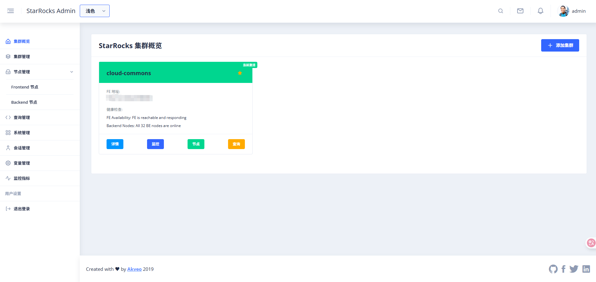
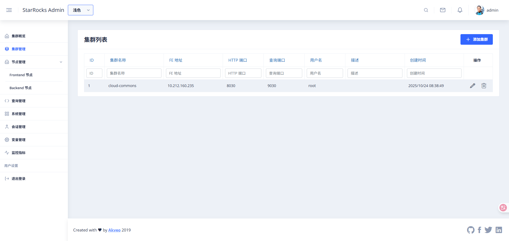
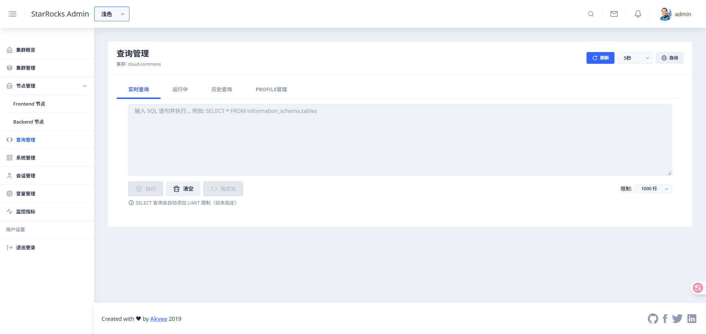
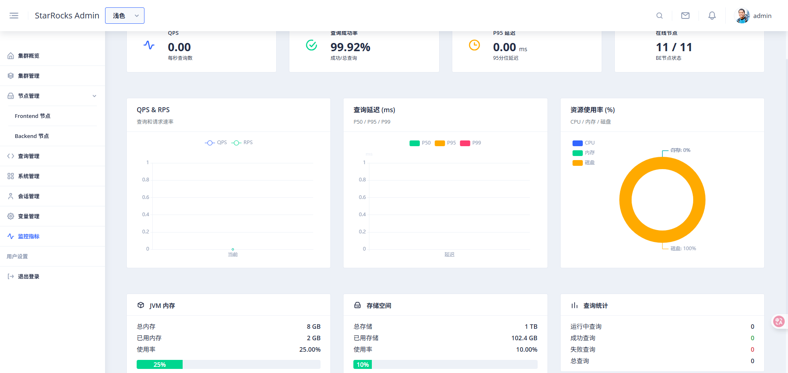
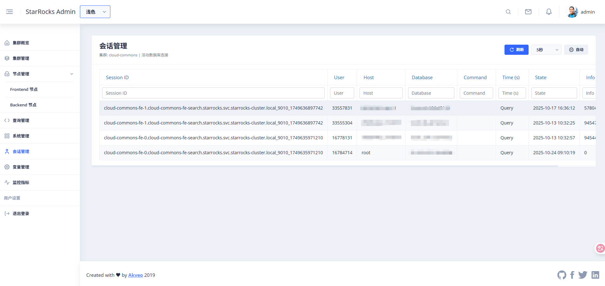
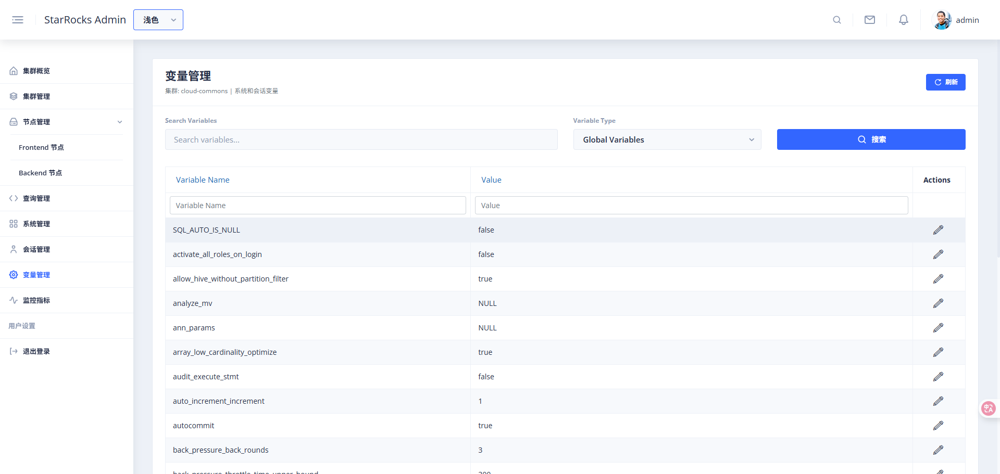
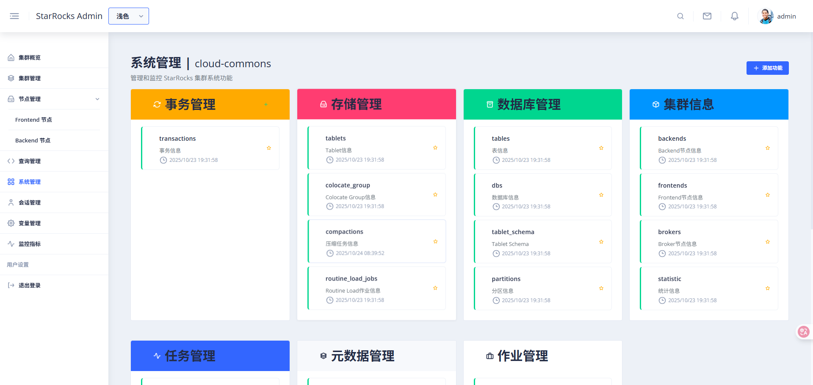

# StarRocks Admin

<div align="center">


**一个现代化、美观、智能的 StarRocks 集群管理平台**

[功能特性](#-功能特性) • [快速开始](#-快速开始) • [部署指南](#-部署指南) • [API 文档](#-api-文档) • [贡献](#-贡献)

</div>

## 📖 简介

StarRocks Admin 是一个专业的、企业级的 StarRocks 数据库集群管理工具，提供直观的 Web 界面来管理和监控多个 StarRocks 集群。相比 StarRocks 原生的管理界面，本平台提供了更丰富的功能和更好的用户体验。

### ✨ 核心特性

- 🚀 **一键部署** - 支持传统部署、Docker 和 Kubernetes
- 📊 **实时监控** - 查看集群的实时状态和性能指标
- 🔧 **集群管理** - 统一管理多个 StarRocks 集群
- 🎨 **现代 UI** - 基于 Angular + Nebular 的现代化界面
- 🔐 **安全认证** - JWT 认证和权限管理
- 📈 **性能分析** - 查询性能分析和优化建议

## 🚀 快速开始

### 方式一：一键部署（推荐）

```bash
# 1. 克隆项目
git clone https://github.com/jlon/starrocks-admin.git
cd starrocks-admin

# 2. 构建和打包
make build

# 3. 启动服务
cd build/dist
./bin/starrocks-admin.sh start

# 4. 访问应用
open http://localhost:8080
```

### 方式二：Docker 部署

```bash
# 1. 克隆项目
git clone https://github.com/jlon/starrocks-admin.git
cd starrocks-admin

# 2. 启动服务
make docker-build  # 构建 Docker 镜像
make docker-up     # 启动 Docker 容器

# 3. 访问应用
open http://localhost:8080
```

## 🎨 界面预览

StarRocks Admin 提供了直观、美观的 Web 管理界面,涵盖集群管理的各个方面。

### 集群概览

实时展示集群整体状态、性能指标和资源使用情况,一目了然掌握集群健康状态。

### 集群管理

统一管理多个 StarRocks 集群,支持添加、编辑、删除集群配置。

### 节点管理

查看和管理集群中的所有节点,监控各节点的运行状态和资源使用。

### 查询管理

实时查看正在执行的查询,支持查询终止和性能分析。

### 监控管理

详细的监控指标展示,包括 QPS、延迟、资源使用等关键性能数据。

### 会话管理

管理数据库连接会话,查看活跃会话和历史连接信息。

### 变量管理

配置和管理系统变量,支持查看和修改运行时参数。

### 系统管理

系统级别的配置管理,包括用户权限、系统函数等功能。

## 🔧 配置说明

### 主配置文件 (conf/config.toml)

```toml
[server]
host = "0.0.0.0"
port = 8080

[database]
url = "sqlite://data/starrocks-admin.db"

[auth]
jwt_secret = "your-secret-key-change-in-production"
jwt_expires_in = "24h"

[cors]
allow_origin = "http://localhost:4200"

[logging]
level = "info,starrocks_admin_backend=debug"
file = "logs/starrocks-admin.log"

[static_config]
enabled = true
web_root = "web"
```

## 🤝 贡献

我们欢迎所有形式的贡献！请遵循以下步骤：

1. **Fork 项目**
2. **创建特性分支** (`git checkout -b feature/AmazingFeature`)
3. **提交更改** (`git commit -m 'Add some AmazingFeature'`)
4. **推送分支** (`git push origin feature/AmazingFeature`)
5. **创建 Pull Request**

## 📄 许可证

本项目采用 MIT 许可证 - 查看 [LICENSE](LICENSE) 文件了解详情。

## 🙏 致谢

- [ngx-admin](https://github.com/akveo/ngx-admin) - 优秀的 Angular 管理模板
- [Nebular](https://akveo.github.io/nebular/) - 漂亮的 UI 组件库
- [Axum](https://github.com/tokio-rs/axum) - 强大的 Rust Web 框架
- [StarRocks](https://www.starrocks.io/) - 高性能分析数据库

## 📞 支持

- 📧 **邮箱**: itjlon@gmail.com
- 🐛 **问题反馈**: [GitHub Issues](https://github.com/your-org/starrocks-admin/issues)
- 💬 **讨论**: [GitHub Discussions](https://github.com/your-org/starrocks-admin/discussions)
- 📖 **文档**: [项目文档](https://docs.starrocks-admin.com)

---

<div align="center">

**Made with ❤️ for StarRocks Community**

[⬆ 回到顶部](#starrocks-admin)

</div>