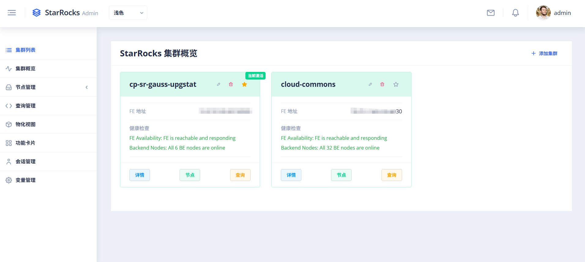
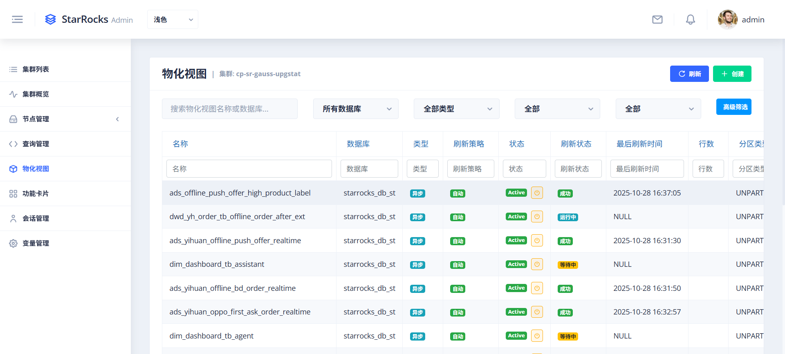
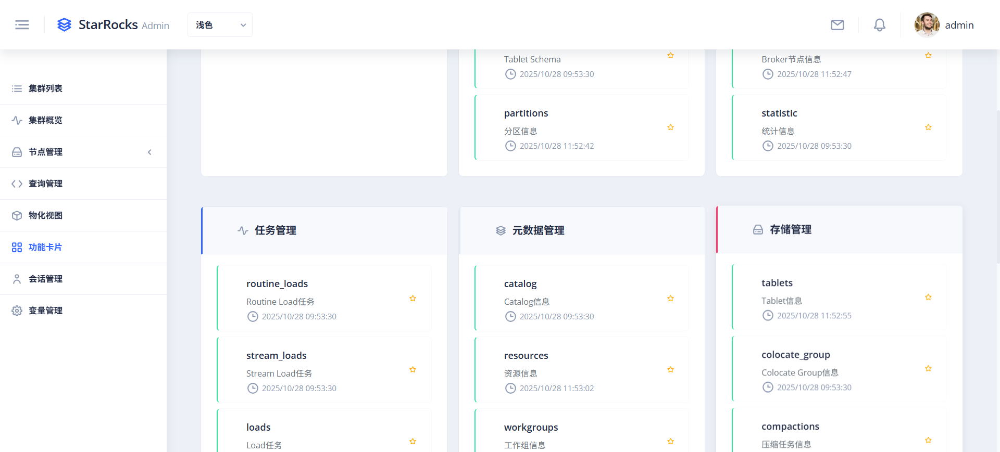

# StarRocks Admin

<div align="center">


**A modern, beautiful, and intelligent StarRocks cluster management platform**

[Features](#-features) • [Quick Start](#-quick-start) • [Deployment](#-deployment) • [API Documentation](#-api-documentation) • [Contributing](#-contributing)

[中文版](#中文版) | [English](#english)

</div>

## 📖 Introduction

StarRocks Admin is a professional, enterprise-grade StarRocks database cluster management tool that provides an intuitive web interface for managing and monitoring multiple StarRocks clusters. Compared to StarRocks' native management interface, this platform offers richer functionality and a better user experience.

### ✨ Core Features

- 🚀 **One-Click Deployment** - Supports traditional deployment, Docker, and Kubernetes
- 📊 **Real-time Monitoring** - View real-time cluster status and performance metrics
- 🔧 **Cluster Management** - Unified management of multiple StarRocks clusters
- 🎨 **Modern UI** - Modern interface based on Angular + Nebular
- 🔐 **Security Authentication** - JWT authentication and permission management
- 📈 **Performance Analysis** - Query performance analysis and optimization suggestions

## 🚀 Quick Start

### Method 1: One-Click Deployment (Recommended)

```bash
# 1. Clone the project
git clone https://github.com/jlon/starrocks-admin.git
cd starrocks-admin

# 2. Build and package
make build

# 3. Start the service
cd build/dist
./bin/starrocks-admin.sh start

# 4. Access the application
open http://localhost:8080
```

### Method 2: Docker Deployment

```bash
# 1. Clone the project
git clone https://github.com/jlon/starrocks-admin.git
cd starrocks-admin

# 2. Start the service
make docker-build  # Build Docker image
make docker-up     # Start Docker container

# 3. Access the application
open http://localhost:8080
```

## 🎨 Interface Preview

StarRocks Admin provides an intuitive and beautiful web management interface covering all aspects of cluster management.

### Cluster Overview

Real-time display of overall cluster status, performance metrics, and resource usage for a comprehensive view of cluster health.

### Cluster Management

Unified management of multiple StarRocks clusters with support for adding, editing, and deleting cluster configurations.

### Node Management

View and manage all nodes in the cluster, monitoring the running status and resource usage of each node.

### Query Management

Real-time view of executing queries with support for query termination and performance analysis.

### Materialized Views

View and manage all materialized views in the cluster, with support for enabling, disabling, and editing.

### Session Management

Manage database connection sessions, view active sessions and historical connection information.

### Variable Management

Configure and manage system variables with support for viewing and modifying runtime parameters.

### Feature Cards

System-level configuration management including user permissions, system functions, and more. Also supports custom SQL.

## 🔧 Configuration

### Main Configuration File (conf/config.toml)

```toml
[server]
host = "0.0.0.0"
port = 8080

[database]
url = "sqlite://data/starrocks-admin.db"

[auth]
jwt_secret = "your-secret-key-change-in-production"
jwt_expires_in = "24h"

[logging]
level = "info,starrocks_admin_backend=debug"
file = "logs/starrocks-admin.log"

[static_config]
enabled = true
web_root = "web"
```

## 🤝 Contributing

We welcome all forms of contributions! Please follow these steps:

1. **Fork the project**
2. **Create a feature branch** (`git checkout -b feature/AmazingFeature`)
3. **Commit your changes** (`git commit -m 'Add some AmazingFeature'`)
4. **Push to the branch** (`git push origin feature/AmazingFeature`)
5. **Create a Pull Request**

## 📄 License

This project is licensed under the MIT License - see the [LICENSE](LICENSE) file for details.

## 🙏 Acknowledgments

- [ngx-admin](https://github.com/John/ngx-admin) - Excellent Angular admin template
- [Nebular](https://John.github.io/nebular/) - Beautiful UI component library
- [Axum](https://github.com/tokio-rs/axum) - Powerful Rust web framework
- [StarRocks](https://www.starrocks.io/) - High-performance analytical database

## 💝 Donation Support

<div align="center">


**Your donation will help me continue open-source development. Thank you very much.**

---

**Made with ❤️ for StarRocks Community**

[⬆ Back to Top](#starrocks-admin)

</div>

---

# 中文版

<div align="center">

**一个现代化、美观、智能的 StarRocks 集群管理平台**

[功能特性](#-功能特性) • [快速开始](#-快速开始) • [部署指南](#-部署指南) • [API 文档](#-api-文档) • [贡献](#-贡献)

[English](#english) | [中文版](#中文版)

</div>

## 📖 简介

StarRocks Admin 是一个专业的、企业级的 StarRocks 数据库集群管理工具，提供直观的 Web 界面来管理和监控多个 StarRocks 集群。相比 StarRocks 原生的管理界面，本平台提供了更丰富的功能和更好的用户体验。

### ✨ 核心特性

- 🚀 **一键部署** - 支持传统部署、Docker 和 Kubernetes
- 📊 **实时监控** - 查看集群的实时状态和性能指标
- 🔧 **集群管理** - 统一管理多个 StarRocks 集群
- 🎨 **现代 UI** - 基于 Angular + Nebular 的现代化界面
- 🔐 **安全认证** - JWT 认证和权限管理
- 📈 **性能分析** - 查询性能分析和优化建议

## 🚀 快速开始

### 方式一：一键部署（推荐）

```bash
# 1. 克隆项目
git clone https://github.com/jlon/starrocks-admin.git
cd starrocks-admin

# 2. 构建和打包
make build

# 3. 启动服务
cd build/dist
./bin/starrocks-admin.sh start

# 4. 访问应用
open http://localhost:8080
```

### 方式二：Docker 部署

```bash
# 1. 克隆项目
git clone https://github.com/jlon/starrocks-admin.git
cd starrocks-admin

# 2. 启动服务
make docker-build  # 构建 Docker 镜像
make docker-up     # 启动 Docker 容器

# 3. 访问应用
open http://localhost:8080
```

## 🎨 界面预览

StarRocks Admin 提供了直观、美观的 Web 管理界面，涵盖集群管理的各个方面。

### 集群概览

实时展示集群整体状态、性能指标和资源使用情况，一目了然掌握集群健康状态。

### 集群管理

统一管理多个 StarRocks 集群，支持添加、编辑、删除集群配置。

### 节点管理

查看和管理集群中的所有节点，监控各节点的运行状态和资源使用。

### 查询管理

实时查看正在执行的查询，支持查询终止和性能分析。

### 物化视图

查看和管理集群中的所有物化视图，可以开启关闭编辑等。

### 会话管理

管理数据库连接会话，查看活跃会话和历史连接信息。

### 变量管理

配置和管理系统变量，支持查看和修改运行时参数。

### 功能卡片

系统级别的配置管理，包括用户权限、系统函数等功能。还支持自定义SQL。

## 🔧 配置说明

### 主配置文件 (conf/config.toml)

```toml
[server]
host = "0.0.0.0"
port = 8080

[database]
url = "sqlite://data/starrocks-admin.db"

[auth]
jwt_secret = "your-secret-key-change-in-production"
jwt_expires_in = "24h"

[logging]
level = "info,starrocks_admin_backend=debug"
file = "logs/starrocks-admin.log"

[static_config]
enabled = true
web_root = "web"
```

## 🤝 贡献

我们欢迎所有形式的贡献！请遵循以下步骤：

1. **Fork 项目**
2. **创建特性分支** (`git checkout -b feature/AmazingFeature`)
3. **提交更改** (`git commit -m 'Add some AmazingFeature'`)
4. **推送分支** (`git push origin feature/AmazingFeature`)
5. **创建 Pull Request**

## 📄 许可证

本项目采用 MIT 许可证 - 查看 [LICENSE](LICENSE) 文件了解详情。

## 🙏 致谢

- [ngx-admin](https://github.com/John/ngx-admin) - 优秀的 Angular 管理模板
- [Nebular](https://John.github.io/nebular/) - 漂亮的 UI 组件库
- [Axum](https://github.com/tokio-rs/axum) - 强大的 Rust Web 框架
- [StarRocks](https://www.starrocks.io/) - 高性能分析数据库

## 💝 捐赠支持

<div align="center">


**您的捐赠将帮助我持续开源更新，非常感谢。**

---

**Made with ❤️ for StarRocks Community**

[⬆ 回到顶部](#starrocks-admin)

</div>