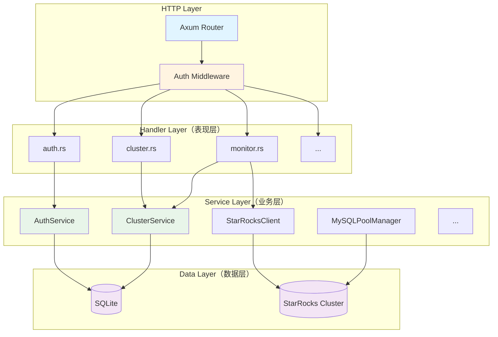
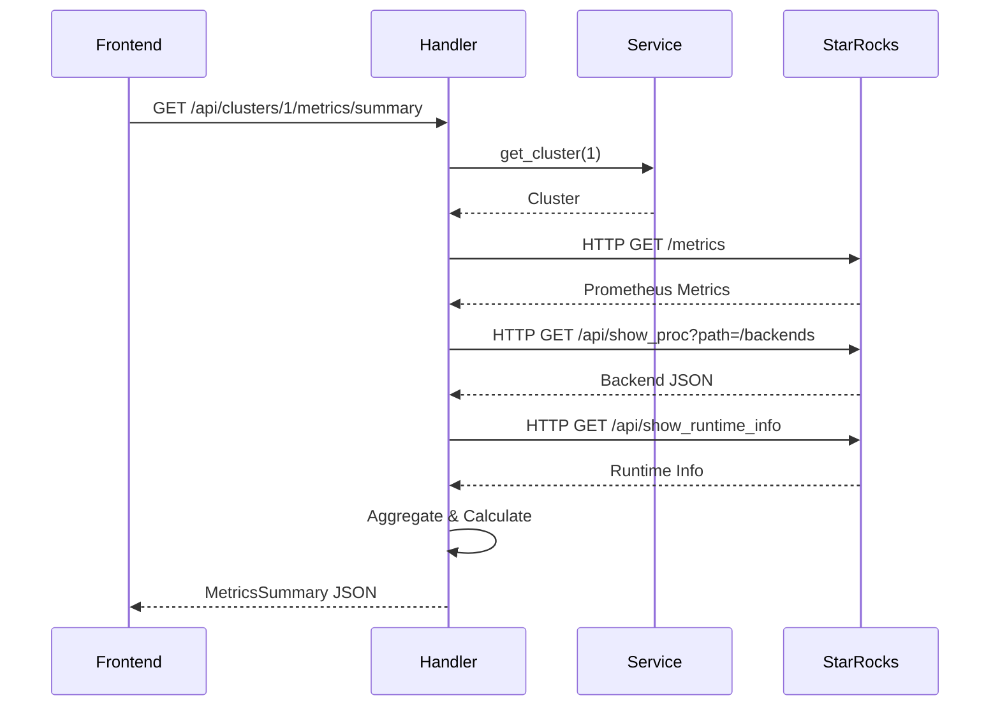
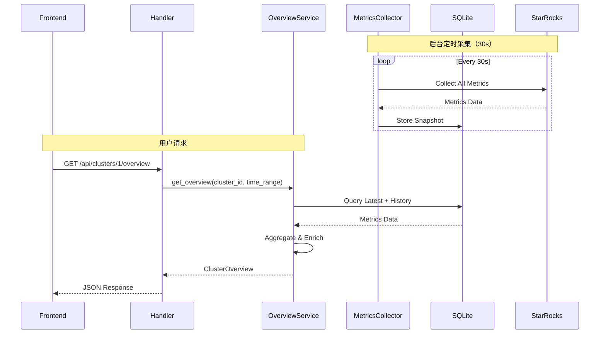
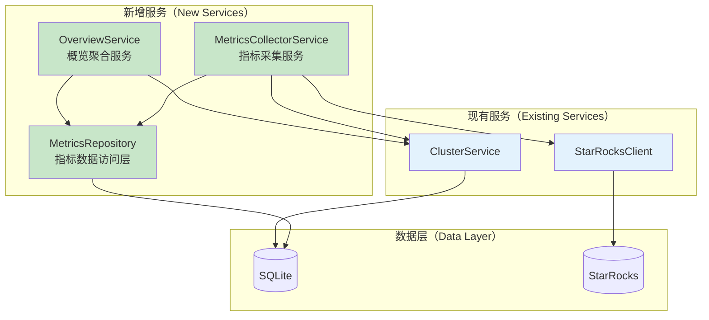

# 后端架构分析与集群概览集成方案

> **文档作者**：架构师视角  
> **日期**：2025-10-24  
> **目标**：分析现有架构，设计集群概览功能的最佳集成方案

---

## 📋 目录

- [一、现有架构深度分析](#一现有架构深度分析)
- [二、架构优势与可扩展点](#二架构优势与可扩展点)
- [三、集成方案设计](#三集成方案设计)
- [四、实施路线图](#四实施路线图)
- [五、风险评估与缓解](#五风险评估与缓解)

---

## 一、现有架构深度分析

### 1.1 整体架构模式

当前采用**经典三层架构** + **DDD轻量化**设计：



### 1.2 核心设计模式

#### 1.2.1 依赖注入（DI）模式

```rust
// main.rs - 依赖注入容器
pub struct AppState {
    pub db: SqlitePool,                      // 数据库连接池
    pub mysql_pool_manager: MySQLPoolManager, // MySQL 连接池管理器
    pub auth_service: AuthService,            // 认证服务
    pub cluster_service: ClusterService,      // 集群服务
    pub system_function_service: SystemFunctionService,
}
```

**优点**：
- ✅ 服务解耦，易于测试
- ✅ 通过 Arc 实现线程安全的共享
- ✅ 便于添加新服务

**扩展点**：
- 🔧 可以添加 `MetricsCollectorService` 到 AppState
- 🔧 可以添加 `OverviewService` 作为聚合服务

#### 1.2.2 Repository 模式（隐式）

虽然没有显式定义 Repository 接口，但 `ClusterService` 实际上承担了 Repository 职责：

```rust
impl ClusterService {
    // CRUD operations - Repository pattern
    pub async fn create_cluster(&self, ...) -> ApiResult<Cluster>
    pub async fn list_clusters(&self) -> ApiResult<Vec<Cluster>>
    pub async fn get_cluster(&self, cluster_id: i64) -> ApiResult<Cluster>
    pub async fn update_cluster(&self, ...) -> ApiResult<Cluster>
    pub async fn delete_cluster(&self, cluster_id: i64) -> ApiResult<()>
}
```

**优点**：
- ✅ 数据访问逻辑集中
- ✅ 易于维护和测试

**改进建议**：
- 💡 可以将 Service 拆分为 `ClusterRepository`（数据访问）+ `ClusterService`（业务逻辑）
- 💡 但对于当前规模，合并设计是合理的（KISS 原则）

#### 1.2.3 Client 抽象模式

```rust
pub struct StarRocksClient {
    cluster: Cluster,
}

impl StarRocksClient {
    // 封装 StarRocks HTTP API 调用
    pub async fn get_metrics(&self) -> ApiResult<String>
    pub async fn get_backends(&self) -> ApiResult<Vec<Backend>>
    pub async fn get_runtime_info(&self) -> ApiResult<RuntimeInfo>
    // ...
}
```

**优点**：
- ✅ 隔离外部依赖
- ✅ 便于 Mock 测试
- ✅ 易于切换不同的通信协议

**扩展点**：
- 🔧 可以为新 API 添加方法（如 `get_databases()`, `get_tables()`, `get_schema_changes()`）

#### 1.2.4 状态管理模式

路由层使用不同粒度的 State：

```rust
// 不同的 State 粒度
let cluster_routes = Router::new()
    .route("/api/clusters/:id/metrics/summary", get(handlers::monitor::get_metrics_summary))
    .with_state(cluster_service.clone());  // 只依赖 ClusterService

let app_routes = Router::new()
    .route("/api/clusters/:id/health", get(handlers::cluster::get_cluster_health))
    .with_state(app_state_arc);  // 依赖完整 AppState
```

**优点**：
- ✅ 最小依赖原则（Principle of Least Privilege）
- ✅ 降低耦合度

### 1.3 数据流分析

#### 1.3.1 实时数据流（当前）



**特点**：
- ⚡ 实时性好（延迟 <100ms）
- ❌ 无历史数据
- ❌ 每次请求都需要多次调用 StarRocks
- ❌ 无法展示趋势图

#### 1.3.2 期望数据流（集群概览）



**优势**：
- ✅ 支持历史数据和趋势分析
- ✅ 减少对 StarRocks 的实时压力
- ✅ 响应速度更快（直接查 SQLite）
- ✅ 数据一致性更好

### 1.4 现有监控实现分析

#### 监控现状

**文件**：`backend/src/handlers/monitor.rs`

```rust
pub async fn get_metrics_summary(
    State(cluster_service): State<ClusterServiceState>,
    Path(cluster_id): Path<i64>,
) -> ApiResult<Json<MetricsSummary>> {
    // 1. 获取集群信息
    let cluster = cluster_service.get_cluster(cluster_id).await?;
    let client = StarRocksClient::new(cluster);

    // 2. 实时拉取数据（无缓存）
    let metrics_text = client.get_metrics().await?;
    let metrics_map = client.parse_prometheus_metrics(&metrics_text)?;
    let backends = client.get_backends().await?;
    let runtime_info = client.get_runtime_info().await?;

    // 3. 聚合计算
    // ... 汇总 backends 的 CPU、内存、磁盘等
    
    // 4. 返回快照数据
    Ok(Json(summary))
}
```

**问题**：
1. ❌ **无历史数据**：只能看到当前快照
2. ❌ **重复计算**：每次请求都重新聚合
3. ❌ **性能瓶颈**：多个 HTTP 调用串行执行
4. ❌ **数据孤岛**：`monitor_history` 表存在但未使用

**优点**：
- ✅ 实时性强
- ✅ 实现简单

### 1.5 数据库设计分析

#### 现有表结构

```sql
-- 已存在但未充分利用
CREATE TABLE monitor_history (
    id INTEGER PRIMARY KEY AUTOINCREMENT,
    cluster_id INTEGER NOT NULL,
    metric_name VARCHAR(100) NOT NULL,
    metric_value TEXT NOT NULL,  -- ⚠️ 存储格式不明确
    collected_at TIMESTAMP DEFAULT CURRENT_TIMESTAMP,
    FOREIGN KEY (cluster_id) REFERENCES clusters(id) ON DELETE CASCADE
);

CREATE INDEX idx_monitor_history_cluster_metric ON monitor_history(cluster_id, metric_name);
CREATE INDEX idx_monitor_history_collected_at ON monitor_history(collected_at);
```

**问题**：
1. ⚠️ `metric_value TEXT` - 类型不明确，可能是 JSON 字符串
2. ⚠️ 缺少 `metric_type` 字段区分不同类型的指标
3. ⚠️ 没有数据保留策略（可能无限增长）
4. ⚠️ 索引设计未充分优化范围查询

**改进方案**：
- 见"三、集成方案设计"

---

## 二、架构优势与可扩展点

### 2.1 架构优势（保持并发扬）

#### ✅ 1. 清晰的分层架构
- **Handler 层专注于请求响应**：轻薄的适配层
- **Service 层封装业务逻辑**：易于复用和测试
- **Client 层隔离外部依赖**：降低耦合

#### ✅ 2. 依赖注入设计
- 所有服务通过 AppState 统一管理
- 使用 Arc 实现线程安全的共享
- 便于添加新服务

#### ✅ 3. 类型安全
- 强类型模型定义（`models/`）
- 编译期错误检查
- Serde 自动序列化/反序列化

#### ✅ 4. 良好的错误处理
- 统一的 `ApiResult<T>` 返回类型
- `ApiError` 封装错误信息
- 便于前端统一处理

#### ✅ 5. 数据库迁移管理
- 使用 `sqlx::migrate` 管理 schema 变更
- 版本化管理，易于回滚

### 2.2 可扩展点（新功能嵌入点）

#### 🔧 扩展点 1：添加新服务

```rust
// ✅ 可以无缝添加新服务到 AppState
pub struct AppState {
    pub db: SqlitePool,
    pub mysql_pool_manager: MySQLPoolManager,
    pub auth_service: AuthService,
    pub cluster_service: ClusterService,
    pub system_function_service: SystemFunctionService,
    // 🆕 新增
    pub metrics_collector_service: MetricsCollectorService,  // 指标采集服务
    pub overview_service: OverviewService,                   // 概览聚合服务
}
```

#### 🔧 扩展点 2：添加新的 Handler

```rust
// handlers/overview.rs - 新增 handler 模块
pub async fn get_cluster_overview(
    State(overview_service): State<Arc<OverviewService>>,
    Path(cluster_id): Path<i64>,
    Query(params): Query<OverviewQueryParams>,
) -> ApiResult<Json<ClusterOverview>> {
    // ... 实现
}
```

#### 🔧 扩展点 3：扩展 StarRocksClient

```rust
impl StarRocksClient {
    // ✅ 添加新的 API 方法
    pub async fn get_databases(&self) -> ApiResult<Vec<Database>> { /* ... */ }
    pub async fn get_tables(&self, db: &str) -> ApiResult<Vec<Table>> { /* ... */ }
    pub async fn get_table_info(&self, db: &str, table: &str) -> ApiResult<TableInfo> { /* ... */ }
    pub async fn get_schema_changes(&self) -> ApiResult<Vec<SchemaChange>> { /* ... */ }
}
```

#### 🔧 扩展点 4：数据库 Schema 扩展

```sql
-- migrations/20250124_add_cluster_overview.sql
-- ✅ 通过新的 migration 文件添加表

CREATE TABLE metrics_snapshots (...);
CREATE TABLE daily_snapshots (...);
```

#### 🔧 扩展点 5：后台任务

```rust
// ✅ 在 main.rs 中启动后台任务
#[tokio::main]
async fn main() -> Result<(), Box<dyn std::error::Error>> {
    // ... 现有初始化 ...
    
    // 🆕 启动指标采集器
    let collector = MetricsCollectorService::new(/* ... */);
    tokio::spawn(async move {
        collector.start_collection().await;
    });
    
    // ... 启动 HTTP 服务 ...
}
```

---

## 三、集成方案设计

### 3.1 架构集成原则

#### 原则 1️⃣：最小侵入性（Minimal Invasion）
- ✅ 不修改现有代码的核心逻辑
- ✅ 通过扩展而非修改（Open-Closed Principle）
- ✅ 现有 API 保持向后兼容

#### 原则 2️⃣：单一职责（Single Responsibility）
- ✅ 每个服务只负责一件事
- ✅ 采集、存储、查询、聚合分离

#### 原则 3️⃣：依赖倒置（Dependency Inversion）
- ✅ 高层模块不依赖低层模块
- ✅ 通过接口/trait 解耦

#### 原则 4️⃣：可测试性（Testability）
- ✅ 所有服务可独立测试
- ✅ 支持 Mock 外部依赖

### 3.2 新增组件设计

#### 3.2.1 服务层架构



#### 3.2.2 MetricsCollectorService（核心新增）

**职责**：
- 📊 定时采集所有集群的指标
- 💾 存储到 SQLite
- 🗑️ 自动清理过期数据

**设计**：

```rust
// services/metrics_collector_service.rs

use std::sync::Arc;
use tokio::time::{interval, Duration};
use sqlx::SqlitePool;
use crate::services::{ClusterService, StarRocksClient};

pub struct MetricsCollectorService {
    db: SqlitePool,
    cluster_service: Arc<ClusterService>,
    collection_interval: Duration,  // 30 秒
    retention_days: i64,             // 7 天
}

impl MetricsCollectorService {
    pub fn new(
        db: SqlitePool,
        cluster_service: Arc<ClusterService>,
    ) -> Self {
        Self {
            db,
            cluster_service,
            collection_interval: Duration::from_secs(30),
            retention_days: 7,
        }
    }

    // 启动定时采集（在 main.rs 中调用）
    pub async fn start_collection(self: Arc<Self>) {
        let mut ticker = interval(self.collection_interval);
        
        loop {
            ticker.tick().await;
            
            if let Err(e) = self.collect_all_clusters().await {
                tracing::error!("Failed to collect metrics: {}", e);
            }
        }
    }

    // 采集所有集群的指标
    async fn collect_all_clusters(&self) -> Result<(), anyhow::Error> {
        let clusters = self.cluster_service.list_clusters().await?;
        
        for cluster in clusters {
            if let Err(e) = self.collect_cluster_metrics(&cluster).await {
                tracing::error!("Failed to collect metrics for cluster {}: {}", 
                               cluster.id, e);
                // 继续采集其他集群
            }
        }
        
        // 清理过期数据
        self.cleanup_old_metrics().await?;
        
        Ok(())
    }

    // 采集单个集群的指标
    async fn collect_cluster_metrics(&self, cluster: &Cluster) -> Result<(), anyhow::Error> {
        let client = StarRocksClient::new(cluster.clone());
        
        // 1. 采集 Prometheus 指标
        let metrics_text = client.get_metrics().await?;
        let metrics_map = client.parse_prometheus_metrics(&metrics_text)?;
        
        // 2. 采集 Backends 信息
        let backends = client.get_backends().await?;
        
        // 3. 采集 Runtime 信息
        let runtime_info = client.get_runtime_info().await?;
        
        // 4. 采集数据库/表信息（新增）
        let databases = client.get_databases().await?;
        
        // 5. 采集物化视图信息（可选，如果有 API）
        // let mvs = client.get_materialized_views().await?;
        
        // 6. 聚合并存储
        let snapshot = MetricsSnapshot {
            cluster_id: cluster.id,
            collected_at: Utc::now(),
            // Query metrics
            qps: metrics_map.get("starrocks_fe_qps").copied().unwrap_or(0.0),
            rps: metrics_map.get("starrocks_fe_rps").copied().unwrap_or(0.0),
            query_latency_p99: metrics_map.get("starrocks_fe_query_latency_p99").copied().unwrap_or(0.0),
            // ... 其他指标
            
            // Aggregated metrics
            backend_total: backends.len() as i32,
            backend_alive: backends.iter().filter(|b| b.alive == "true").count() as i32,
            total_cpu_usage: backends.iter()
                .filter_map(|b| b.cpu_used_pct.trim_end_matches('%').parse::<f64>().ok())
                .sum(),
            // ... 更多聚合指标
        };
        
        // 保存到数据库
        self.save_snapshot(&snapshot).await?;
        
        Ok(())
    }

    // 保存快照到数据库
    async fn save_snapshot(&self, snapshot: &MetricsSnapshot) -> Result<(), sqlx::Error> {
        sqlx::query!(
            r#"
            INSERT INTO metrics_snapshots (
                cluster_id, collected_at, snapshot_data
            ) VALUES (?, ?, ?)
            "#,
            snapshot.cluster_id,
            snapshot.collected_at,
            serde_json::to_string(snapshot).unwrap()
        )
        .execute(&self.db)
        .await?;
        
        Ok(())
    }

    // 清理过期数据
    async fn cleanup_old_metrics(&self) -> Result<(), sqlx::Error> {
        let cutoff_date = Utc::now() - chrono::Duration::days(self.retention_days);
        
        sqlx::query!(
            "DELETE FROM metrics_snapshots WHERE collected_at < ?",
            cutoff_date
        )
        .execute(&self.db)
        .await?;
        
        tracing::info!("Cleaned up metrics older than {} days", self.retention_days);
        
        Ok(())
    }
}
```

#### 3.2.3 OverviewService（聚合服务）

**职责**：
- 📈 提供集群概览数据（实时 + 历史）
- 🔄 聚合多种数据源
- 🎯 按时间范围查询历史趋势

**设计**：

```rust
// services/overview_service.rs

pub struct OverviewService {
    db: SqlitePool,
    cluster_service: Arc<ClusterService>,
}

impl OverviewService {
    pub fn new(db: SqlitePool, cluster_service: Arc<ClusterService>) -> Self {
        Self { db, cluster_service }
    }

    // 获取集群概览（核心 API）
    pub async fn get_cluster_overview(
        &self,
        cluster_id: i64,
        time_range: TimeRange,
    ) -> ApiResult<ClusterOverview> {
        // 1. 获取最新快照（实时数据）
        let latest = self.get_latest_snapshot(cluster_id).await?;
        
        // 2. 获取历史趋势数据
        let history = self.get_history_snapshots(cluster_id, time_range).await?;
        
        // 3. 计算聚合指标
        let aggregated = self.aggregate_metrics(&latest, &history).await?;
        
        // 4. 组装完整概览
        Ok(ClusterOverview {
            cluster_id,
            timestamp: Utc::now(),
            real_time: latest,
            trends: history,
            aggregated,
        })
    }

    // 获取健康状态卡片
    pub async fn get_health_cards(
        &self,
        cluster_id: i64,
    ) -> ApiResult<Vec<HealthCard>> {
        let snapshot = self.get_latest_snapshot(cluster_id).await?;
        
        Ok(vec![
            HealthCard {
                title: "集群状态".to_string(),
                value: snapshot.cluster_status.clone(),
                status: self.determine_health_status(&snapshot),
                // ...
            },
            // ... 更多卡片
        ])
    }

    // 获取性能趋势
    pub async fn get_performance_trends(
        &self,
        cluster_id: i64,
        time_range: TimeRange,
    ) -> ApiResult<PerformanceTrends> {
        let snapshots = self.get_history_snapshots(cluster_id, time_range).await?;
        
        Ok(PerformanceTrends {
            qps: snapshots.iter().map(|s| (s.collected_at, s.qps)).collect(),
            latency_p99: snapshots.iter().map(|s| (s.collected_at, s.query_latency_p99)).collect(),
            // ...
        })
    }

    // 内部方法：获取最新快照
    async fn get_latest_snapshot(&self, cluster_id: i64) -> ApiResult<MetricsSnapshot> {
        sqlx::query_as!(
            MetricsSnapshot,
            r#"
            SELECT * FROM metrics_snapshots
            WHERE cluster_id = ?
            ORDER BY collected_at DESC
            LIMIT 1
            "#,
            cluster_id
        )
        .fetch_one(&self.db)
        .await
        .map_err(|_| ApiError::new(ErrorCode::NotFound, "No metrics found"))
    }

    // 内部方法：获取历史快照
    async fn get_history_snapshots(
        &self,
        cluster_id: i64,
        time_range: TimeRange,
    ) -> ApiResult<Vec<MetricsSnapshot>> {
        let start_time = time_range.start();
        let end_time = time_range.end();
        
        sqlx::query_as!(
            MetricsSnapshot,
            r#"
            SELECT * FROM metrics_snapshots
            WHERE cluster_id = ? 
              AND collected_at BETWEEN ? AND ?
            ORDER BY collected_at ASC
            "#,
            cluster_id,
            start_time,
            end_time
        )
        .fetch_all(&self.db)
        .await
        .map_err(Into::into)
    }
}
```

#### 3.2.4 扩展 StarRocksClient

**新增方法**：

```rust
// services/starrocks_client.rs

impl StarRocksClient {
    // 🆕 获取数据库列表
    pub async fn get_databases(&self) -> ApiResult<Vec<Database>> {
        let url = format!(
            "{}://{}/api/v1/catalogs/{}/databases",
            self.scheme(),
            self.cluster.fe_host,
            self.cluster.catalog
        );
        
        let response = self.client
            .get(&url)
            .basic_auth(&self.cluster.username, Some(&self.cluster.password_encrypted))
            .send()
            .await?;
        
        self.handle_response(response).await
    }

    // 🆕 获取表列表
    pub async fn get_tables(&self, database: &str) -> ApiResult<Vec<Table>> {
        let url = format!(
            "{}://{}/api/v1/catalogs/{}/databases/{}/tables",
            self.scheme(),
            self.cluster.fe_host,
            self.cluster.catalog,
            database
        );
        
        let response = self.client
            .get(&url)
            .basic_auth(&self.cluster.username, Some(&self.cluster.password_encrypted))
            .send()
            .await?;
        
        self.handle_response(response).await
    }

    // 🆕 获取表详情（包含大小、行数等）
    pub async fn get_table_info(&self, database: &str, table: &str) -> ApiResult<TableInfo> {
        // 方式1：通过 HTTP API（如果支持）
        // 方式2：通过 MySQL 协议查询 information_schema
        // 这里需要结合 MySQLClient
        todo!()
    }

    // 🆕 获取 Schema Change 任务
    pub async fn get_schema_changes(&self) -> ApiResult<Vec<SchemaChange>> {
        let url = format!(
            "{}://{}/api/show_proc?path=/jobs",
            self.scheme(),
            self.cluster.fe_host
        );
        
        let response = self.client
            .get(&url)
            .basic_auth(&self.cluster.username, Some(&self.cluster.password_encrypted))
            .send()
            .await?;
        
        self.handle_response(response).await
    }

    // 🆕 获取活跃用户数（通过 SHOW PROCESSLIST）
    pub async fn get_active_users(&self) -> ApiResult<Vec<String>> {
        let url = format!(
            "{}://{}/api/show_proc?path=/current_queries",
            self.scheme(),
            self.cluster.fe_host
        );
        
        let response = self.client
            .get(&url)
            .basic_auth(&self.cluster.username, Some(&self.cluster.password_encrypted))
            .send()
            .await?;
        
        let queries: Vec<Query> = self.handle_response(response).await?;
        
        // 提取唯一用户
        let unique_users: std::collections::HashSet<String> = queries
            .iter()
            .map(|q| q.user.clone())
            .collect();
        
        Ok(unique_users.into_iter().collect())
    }
}
```

### 3.3 数据库 Schema 设计

#### 3.3.1 优化现有表

保持 `monitor_history` 表不变（向后兼容），新增专用表：

```sql
-- migrations/20250124_add_cluster_overview.sql

-- ========================================
-- 1. 指标快照表（高频采集，30秒一次）
-- ========================================
CREATE TABLE IF NOT EXISTS metrics_snapshots (
    id INTEGER PRIMARY KEY AUTOINCREMENT,
    cluster_id INTEGER NOT NULL,
    collected_at TIMESTAMP NOT NULL DEFAULT CURRENT_TIMESTAMP,
    
    -- 查询性能指标
    qps REAL NOT NULL DEFAULT 0.0,
    rps REAL NOT NULL DEFAULT 0.0,
    query_latency_p50 REAL NOT NULL DEFAULT 0.0,
    query_latency_p95 REAL NOT NULL DEFAULT 0.0,
    query_latency_p99 REAL NOT NULL DEFAULT 0.0,
    query_total BIGINT NOT NULL DEFAULT 0,
    query_success BIGINT NOT NULL DEFAULT 0,
    query_error BIGINT NOT NULL DEFAULT 0,
    query_timeout BIGINT NOT NULL DEFAULT 0,
    
    -- 集群健康指标
    backend_total INTEGER NOT NULL DEFAULT 0,
    backend_alive INTEGER NOT NULL DEFAULT 0,
    frontend_total INTEGER NOT NULL DEFAULT 0,
    frontend_alive INTEGER NOT NULL DEFAULT 0,
    
    -- 资源使用指标
    total_cpu_usage REAL NOT NULL DEFAULT 0.0,
    avg_cpu_usage REAL NOT NULL DEFAULT 0.0,
    total_memory_usage REAL NOT NULL DEFAULT 0.0,
    avg_memory_usage REAL NOT NULL DEFAULT 0.0,
    disk_total_bytes BIGINT NOT NULL DEFAULT 0,
    disk_used_bytes BIGINT NOT NULL DEFAULT 0,
    disk_usage_pct REAL NOT NULL DEFAULT 0.0,
    
    -- 存储指标
    tablet_count BIGINT NOT NULL DEFAULT 0,
    max_compaction_score REAL NOT NULL DEFAULT 0.0,
    
    -- 事务指标
    txn_running INTEGER NOT NULL DEFAULT 0,
    txn_success_total BIGINT NOT NULL DEFAULT 0,
    txn_failed_total BIGINT NOT NULL DEFAULT 0,
    
    -- 负载指标
    load_running INTEGER NOT NULL DEFAULT 0,
    load_finished_total BIGINT NOT NULL DEFAULT 0,
    
    -- 原始数据（JSON 格式，用于灵活扩展）
    raw_metrics TEXT,
    
    FOREIGN KEY (cluster_id) REFERENCES clusters(id) ON DELETE CASCADE
);

-- 索引优化
CREATE INDEX IF NOT EXISTS idx_metrics_snapshots_cluster_time 
ON metrics_snapshots(cluster_id, collected_at DESC);

CREATE INDEX IF NOT EXISTS idx_metrics_snapshots_time 
ON metrics_snapshots(collected_at DESC);

-- ========================================
-- 2. 每日汇总表（低频存储，1天1次）
-- ========================================
CREATE TABLE IF NOT EXISTS daily_snapshots (
    id INTEGER PRIMARY KEY AUTOINCREMENT,
    cluster_id INTEGER NOT NULL,
    snapshot_date DATE NOT NULL,
    
    -- 聚合统计
    avg_qps REAL NOT NULL DEFAULT 0.0,
    max_qps REAL NOT NULL DEFAULT 0.0,
    avg_latency_p99 REAL NOT NULL DEFAULT 0.0,
    total_queries BIGINT NOT NULL DEFAULT 0,
    total_errors BIGINT NOT NULL DEFAULT 0,
    
    -- 容量统计
    avg_disk_usage_pct REAL NOT NULL DEFAULT 0.0,
    max_disk_usage_pct REAL NOT NULL DEFAULT 0.0,
    
    -- 可用性统计
    avg_backend_alive REAL NOT NULL DEFAULT 0.0,
    total_downtime_seconds INTEGER NOT NULL DEFAULT 0,
    
    FOREIGN KEY (cluster_id) REFERENCES clusters(id) ON DELETE CASCADE,
    UNIQUE(cluster_id, snapshot_date)
);

CREATE INDEX IF NOT EXISTS idx_daily_snapshots_cluster_date 
ON daily_snapshots(cluster_id, snapshot_date DESC);

-- ========================================
-- 3. 数据概况缓存表（按需更新）
-- ========================================
CREATE TABLE IF NOT EXISTS data_statistics (
    id INTEGER PRIMARY KEY AUTOINCREMENT,
    cluster_id INTEGER NOT NULL,
    updated_at TIMESTAMP NOT NULL DEFAULT CURRENT_TIMESTAMP,
    
    -- 数据库/表统计
    database_count INTEGER NOT NULL DEFAULT 0,
    table_count INTEGER NOT NULL DEFAULT 0,
    total_data_size BIGINT NOT NULL DEFAULT 0,
    
    -- Top 表（JSON 数组）
    top_tables_by_size TEXT,  -- JSON: [{table, size}, ...]
    top_tables_by_access TEXT,  -- JSON: [{table, access_count}, ...]
    
    -- 物化视图统计
    mv_total INTEGER NOT NULL DEFAULT 0,
    mv_running INTEGER NOT NULL DEFAULT 0,
    mv_failed INTEGER NOT NULL DEFAULT 0,
    
    -- Schema 变更统计
    schema_change_running INTEGER NOT NULL DEFAULT 0,
    schema_change_pending INTEGER NOT NULL DEFAULT 0,
    
    FOREIGN KEY (cluster_id) REFERENCES clusters(id) ON DELETE CASCADE,
    UNIQUE(cluster_id)
);

CREATE INDEX IF NOT EXISTS idx_data_statistics_cluster 
ON data_statistics(cluster_id);
```

#### 3.3.2 数据保留策略

```rust
// 在 MetricsCollectorService 中实现

impl MetricsCollectorService {
    async fn apply_retention_policy(&self) -> Result<(), sqlx::Error> {
        // 1. metrics_snapshots: 保留 7 天
        let cutoff_7d = Utc::now() - chrono::Duration::days(7);
        sqlx::query!("DELETE FROM metrics_snapshots WHERE collected_at < ?", cutoff_7d)
            .execute(&self.db).await?;
        
        // 2. daily_snapshots: 保留 90 天
        let cutoff_90d = Utc::now() - chrono::Duration::days(90);
        sqlx::query!("DELETE FROM daily_snapshots WHERE snapshot_date < ?", cutoff_90d)
            .execute(&self.db).await?;
        
        // 3. 执行 VACUUM 压缩数据库
        sqlx::query("VACUUM").execute(&self.db).await?;
        
        Ok(())
    }
}
```

### 3.4 API 设计

#### 3.4.1 新增 API 端点

```rust
// handlers/overview.rs

// 🆕 获取集群概览
#[utoipa::path(
    get,
    path = "/api/clusters/{id}/overview",
    params(
        ("id" = i64, Path, description = "Cluster ID"),
        ("time_range" = Option<String>, Query, description = "Time range: 1h, 6h, 24h, 3d")
    ),
    responses(
        (status = 200, description = "Cluster overview", body = ClusterOverview),
        (status = 404, description = "Cluster not found")
    ),
    tag = "Cluster Overview"
)]
pub async fn get_cluster_overview(
    State(overview_service): State<Arc<OverviewService>>,
    Path(cluster_id): Path<i64>,
    Query(params): Query<OverviewQueryParams>,
) -> ApiResult<Json<ClusterOverview>> {
    let time_range = params.time_range.unwrap_or_else(|| TimeRange::Hours(24));
    let overview = overview_service.get_cluster_overview(cluster_id, time_range).await?;
    Ok(Json(overview))
}

// 🆕 获取健康状态卡片
#[utoipa::path(
    get,
    path = "/api/clusters/{id}/overview/health",
    tag = "Cluster Overview"
)]
pub async fn get_health_cards(
    State(overview_service): State<Arc<OverviewService>>,
    Path(cluster_id): Path<i64>,
) -> ApiResult<Json<Vec<HealthCard>>> {
    let cards = overview_service.get_health_cards(cluster_id).await?;
    Ok(Json(cards))
}

// 🆕 获取性能趋势
#[utoipa::path(
    get,
    path = "/api/clusters/{id}/overview/performance",
    tag = "Cluster Overview"
)]
pub async fn get_performance_trends(
    State(overview_service): State<Arc<OverviewService>>,
    Path(cluster_id): Path<i64>,
    Query(params): Query<TrendQueryParams>,
) -> ApiResult<Json<PerformanceTrends>> {
    let trends = overview_service.get_performance_trends(cluster_id, params.time_range).await?;
    Ok(Json(trends))
}

// 🆕 获取资源使用趋势
#[utoipa::path(
    get,
    path = "/api/clusters/{id}/overview/resources",
    tag = "Cluster Overview"
)]
pub async fn get_resource_trends(
    State(overview_service): State<Arc<OverviewService>>,
    Path(cluster_id): Path<i64>,
    Query(params): Query<TrendQueryParams>,
) -> ApiResult<Json<ResourceTrends>> {
    let trends = overview_service.get_resource_trends(cluster_id, params.time_range).await?;
    Ok(Json(trends))
}

// 🆕 获取数据统计
#[utoipa::path(
    get,
    path = "/api/clusters/{id}/overview/data-stats",
    tag = "Cluster Overview"
)]
pub async fn get_data_statistics(
    State(overview_service): State<Arc<OverviewService>>,
    Path(cluster_id): Path<i64>,
) -> ApiResult<Json<DataStatistics>> {
    let stats = overview_service.get_data_statistics(cluster_id).await?;
    Ok(Json(stats))
}
```

#### 3.4.2 路由注册

```rust
// main.rs - 添加到路由配置

let overview_routes = Router::new()
    .route("/api/clusters/:id/overview", get(handlers::overview::get_cluster_overview))
    .route("/api/clusters/:id/overview/health", get(handlers::overview::get_health_cards))
    .route("/api/clusters/:id/overview/performance", get(handlers::overview::get_performance_trends))
    .route("/api/clusters/:id/overview/resources", get(handlers::overview::get_resource_trends))
    .route("/api/clusters/:id/overview/data-stats", get(handlers::overview::get_data_statistics))
    .with_state(app_state.overview_service.clone());

// 合并到 protected_routes
let protected_routes = Router::new()
    .merge(auth_routes)
    .merge(cluster_routes)
    .merge(app_routes)
    .merge(overview_routes)  // 🆕 添加概览路由
    .layer(axum_middleware::from_fn_with_state(
        auth_state,
        middleware::auth_middleware,
    ));
```

### 3.5 启动流程集成

#### 修改 main.rs

```rust
// main.rs

#[tokio::main]
async fn main() -> Result<(), Box<dyn std::error::Error>> {
    // ... 现有初始化代码 ...
    
    // 🆕 创建新服务
    let metrics_collector_service = Arc::new(MetricsCollectorService::new(
        pool.clone(),
        cluster_service.clone(),
    ));
    
    let overview_service = Arc::new(OverviewService::new(
        pool.clone(),
        cluster_service.clone(),
    ));

    // 🆕 更新 AppState
    let app_state = AppState {
        db: pool.clone(),
        mysql_pool_manager: (*mysql_pool_manager).clone(),
        auth_service: (*auth_service).clone(),
        cluster_service: (*cluster_service).clone(),
        system_function_service: (*system_function_service).clone(),
        // 新增
        metrics_collector_service: (*metrics_collector_service).clone(),
        overview_service: (*overview_service).clone(),
    };

    // ... 路由配置 ...

    // 🆕 启动后台任务
    let collector_clone = metrics_collector_service.clone();
    tokio::spawn(async move {
        tracing::info!("Starting metrics collector background task");
        collector_clone.start_collection().await;
    });

    // ... 启动 HTTP 服务 ...
}
```

---

## 四、实施路线图

### Phase 1：基础架构搭建（P0）

**目标**：建立核心采集和存储能力

#### 任务清单

- [ ] **Task 1.1**：数据库 Schema 设计与迁移
  - 创建 `metrics_snapshots` 表
  - 创建 `daily_snapshots` 表
  - 创建 `data_statistics` 表
  - 编写迁移文件
  - **预估**：4 小时

- [ ] **Task 1.2**：扩展 StarRocksClient
  - 添加 `get_databases()` 方法
  - 添加 `get_tables()` 方法
  - 添加 `get_schema_changes()` 方法
  - 添加 `get_active_users()` 方法
  - **预估**：6 小时

- [ ] **Task 1.3**：实现 MetricsCollectorService
  - 核心采集逻辑
  - 数据聚合计算
  - 数据持久化
  - 错误处理和重试机制
  - **预估**：10 小时

- [ ] **Task 1.4**：实现 OverviewService
  - `get_cluster_overview()` 核心方法
  - `get_latest_snapshot()` 查询方法
  - `get_history_snapshots()` 查询方法
  - 数据聚合逻辑
  - **预估**：8 小时

- [ ] **Task 1.5**：集成到 main.rs
  - 更新 AppState 结构
  - 启动后台采集任务
  - 配置路由
  - **预估**：2 小时

**Total Phase 1**：30 小时 → **约 4 天**

---

### Phase 2：API 开发（P0）

**目标**：提供完整的 API 接口

#### 任务清单

- [ ] **Task 2.1**：定义数据模型
  - `ClusterOverview` struct
  - `HealthCard` struct
  - `PerformanceTrends` struct
  - `ResourceTrends` struct
  - `DataStatistics` struct
  - **预估**：3 小时

- [ ] **Task 2.2**：实现 overview handler
  - `get_cluster_overview()` handler
  - `get_health_cards()` handler
  - `get_performance_trends()` handler
  - `get_resource_trends()` handler
  - `get_data_statistics()` handler
  - **预估**：6 小时

- [ ] **Task 2.3**：API 文档与测试
  - 添加 Utoipa 文档注解
  - 编写单元测试
  - 编写集成测试
  - **预估**：4 小时

**Total Phase 2**：13 小时 → **约 2 天**

---

### Phase 3：高级功能（P1）

**目标**：性能优化和高级特性

#### 任务清单

- [ ] **Task 3.1**：数据聚合优化
  - 实现每日汇总任务
  - 添加缓存层（可选）
  - **预估**：4 小时

- [ ] **Task 3.2**：Top N 查询优化
  - Top 表按大小查询
  - Top 表按访问量查询（需审计日志）
  - **预估**：6 小时

- [ ] **Task 3.3**：容量预测（可选）
  - 基于历史数据的线性回归
  - 预测磁盘满时间
  - **预估**：8 小时

**Total Phase 3**：18 小时 → **约 2.5 天**

---

### 总计

| Phase | 任务内容 | 预估时间 |
|-------|---------|---------|
| Phase 1 | 基础架构搭建 | 4 天 |
| Phase 2 | API 开发 | 2 天 |
| Phase 3 | 高级功能 | 2.5 天 |
| **Total** | | **8.5 天** |

---

## 五、风险评估与缓解

### 5.1 技术风险

#### 风险 1：后台任务可能影响性能

**描述**：30 秒一次的采集可能对 StarRocks 造成压力

**影响**：中等

**缓解措施**：
- ✅ 使用异步采集，不阻塞主线程
- ✅ 添加采集间隔配置（可调整为 60 秒）
- ✅ 实现采集失败重试机制
- ✅ 监控采集耗时，超时则告警

#### 风险 2：SQLite 数据库增长过快

**描述**：7 天 x 2880 次采集/天 = 20,160 条记录/集群

**影响**：低

**缓解措施**：
- ✅ 实现自动清理策略
- ✅ 定期执行 VACUUM
- ✅ 使用 JSON 存储原始数据，减少列数
- ✅ 考虑引入数据压缩（如果需要）

#### 风险 3：与现有 monitor.rs 的兼容性

**描述**：新旧 API 可能产生混淆

**影响**：低

**缓解措施**：
- ✅ 保留现有 `/api/clusters/:id/metrics/summary` 端点（向后兼容）
- ✅ 新 API 使用不同的路径前缀 `/api/clusters/:id/overview`
- ✅ 在文档中明确说明两者的区别和使用场景

### 5.2 数据一致性风险

#### 风险 4：采集延迟可能导致数据不准确

**描述**：30 秒间隔可能错过短暂的尖峰

**影响**：中等

**缓解措施**：
- ✅ 前端显示数据采集时间戳
- ✅ 提供"刷新"按钮手动触发实时查询
- ✅ 对于关键指标，考虑使用更短的采集间隔（如 15 秒）

### 5.3 开发风险

#### 风险 5：StarRocks API 可能不支持某些指标

**描述**：部分指标可能只能通过 MySQL 协议获取

**影响**：中等

**缓解措施**：
- ✅ 优先验证所有 API 的可用性（参考 `CLUSTER_OVERVIEW_DATA_VALIDATION.md`）
- ✅ 对于不支持的 API，使用 MySQLClient 替代
- ✅ 在设计文档中标注数据来源和获取方式

---

## 六、总结与建议

### 6.1 架构设计亮点

1. **最小侵入性**：新功能完全通过扩展实现，不修改现有代码
2. **职责清晰**：采集、存储、查询、聚合分离
3. **性能优化**：后台采集 + SQLite 缓存，减少对 StarRocks 的压力
4. **可扩展性**：易于添加新指标和新功能
5. **向后兼容**：保留现有 API，不影响现有功能

### 6.2 实施建议

#### 优先级排序

1. **P0（Must Have）**：Phase 1 + Phase 2
   - 核心采集和存储能力
   - 基础 API 接口

2. **P1（Should Have）**：Phase 3
   - 数据聚合优化
   - Top N 查询

3. **P2（Nice to Have）**：
   - 容量预测
   - 告警功能

#### 开发顺序

```
Day 1-2: 数据库 Schema + StarRocksClient 扩展
Day 3-4: MetricsCollectorService 实现
Day 5-6: OverviewService 实现 + API 开发
Day 7-8: 测试、优化、文档
Day 9+:   Phase 3 高级功能
```

### 6.3 代码质量保证

- ✅ 所有服务编写单元测试（覆盖率 >80%）
- ✅ 关键 API 编写集成测试
- ✅ 使用 `tracing` 添加详细日志
- ✅ 错误处理遵循现有 `ApiError` 模式
- ✅ 代码符合 Rust 最佳实践（Clippy 检查）

---

**现在，我们有了清晰的架构集成方案，可以开始实施了！** 🚀

