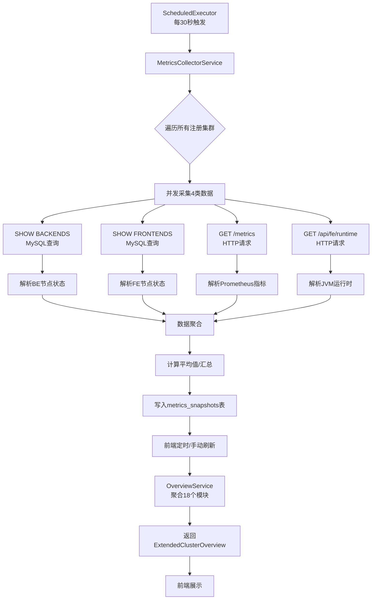

# StarRocks Admin - 集群概览功能实现总结

> **文档版本**: v1.0  
> **创建日期**: 2025-10-27  
> **状态**: P1阶段完成，P2阶段待修复

---

## 📋 目录

1. [项目架构](#1-项目架构)
2. [开发环境启动](#2-开发环境启动)
3. [集群注册与连接](#3-集群注册与连接)
4. [测试流程](#4-测试流程)
5. [已实现功能](#5-已实现功能)
6. [存在的问题](#6-存在的问题)
7. [数据采集流程](#7-数据采集流程)
8. [Bug修复记录](#8-bug修复记录)
9. [下一步计划](#9-下一步计划)

---

## 1. 项目架构

### 1.1 技术栈

| 层级 | 技术 | 用途 |
|-----|------|------|
| **后端** | Rust + Axum | Web框架 |
| | SQLx + SQLite | 数据持久化 |
| | JWT | 身份认证 |
| | Tokio | 异步运行时 |
| **前端** | Angular 15 | 框架 |
| | ngx-admin | UI模板 |
| | Nebular UI | 组件库 |
| | ECharts | 图表库 |
| | CountUp.js | 数字动画 |
| **数据采集** | ScheduledExecutor | 定时任务（30秒） |
| | MySQLClient | StarRocks连接池 |
| | HTTP Client | Prometheus指标 |

### 1.2 目录结构

```
starrocks-admin/
├── backend/
│   ├── src/
│   │   ├── services/
│   │   │   ├── metrics_collector_service.rs   # 指标采集服务
│   │   │   ├── overview_service.rs             # 概览数据聚合
│   │   │   ├── data_statistics_service.rs      # 数据统计服务
│   │   │   ├── starrocks_client.rs             # StarRocks客户端
│   │   │   └── mysql_client.rs                 # MySQL连接池管理
│   │   ├── handlers/
│   │   │   └── monitor.rs                      # 概览API处理器
│   │   └── main.rs                             # 服务入口
│   └── migrations/                             # 数据库迁移脚本
├── frontend/
│   └── src/app/
│       ├── @core/data/
│       │   └── overview.service.ts             # 概览API服务
│       └── pages/starrocks/cluster-overview/
│           ├── cluster-overview.component.ts   # 概览组件
│           ├── cluster-overview.component.html # 模板
│           └── cluster-overview.component.scss # 样式
├── scripts/
│   ├── dev/
│   │   ├── start_backend.sh                    # 后端启动脚本
│   │   └── start_frontend.sh                   # 前端启动脚本
│   └── test/
│       └── test-cluster-overview-full.sh       # 完整测试脚本
└── docs/
    ├── CLUSTER_OVERVIEW_PLAN.md                # 实现计划
    └── CLUSTER_OVERVIEW_P1_COMPLETION_REPORT.md # P1完成报告
```

---

## 2. 开发环境启动

### 2.1 启动后端服务

```bash
cd /home/oppo/Documents/starrocks-admin
bash scripts/dev/start_backend.sh
```

**脚本执行流程**:

1. ✅ 删除旧数据库文件
   ```bash
   rm -f /tmp/starrocks-admin.db
   ```

2. ✅ 编译后端代码
   ```bash
   cargo build --release
   ```

3. ✅ 运行数据库迁移
   - 创建users表
   - 创建clusters表
   - 创建metrics_snapshots表
   - 创建data_statistics表
   - 等12个表

4. ✅ 启动服务
   - 监听地址: `0.0.0.0:8081`
   - API基础路径: `http://localhost:8081/api`

5. ✅ 初始化管理员账户
   - 用户名: `admin`
   - 密码: `admin`

**验证后端启动成功**:
```bash
# 检查进程
ps aux | grep starrocks-admin | grep -v grep

# 检查日志
tail -f backend/logs/starrocks-admin.log

# 测试健康检查
curl http://localhost:8081/health
```

### 2.2 启动前端服务

```bash
cd /home/oppo/Documents/starrocks-admin/frontend
npm run start
```

- **访问地址**: http://localhost:4200
- **开发端口**: 4200
- **热更新**: 已启用

### 2.3 登录系统

**Web UI登录**:
1. 访问: http://localhost:4200
2. 用户名: `admin`
3. 密码: `admin`

**API登录获取Token**:
```bash
TOKEN=$(curl -s -X POST http://localhost:8081/api/auth/login \
  -H "Content-Type: application/json" \
  -d '{"username":"admin","password":"admin"}' | jq -r '.token')

echo "Token: $TOKEN"
```

---

## 3. 集群注册与连接

### 3.1 方法1: 通过API注册（推荐）

#### 步骤1: 获取JWT Token
```bash
TOKEN=$(curl -s -X POST http://localhost:8081/api/auth/login \
  -H "Content-Type: application/json" \
  -d '{"username":"admin","password":"admin"}' | jq -r '.token')
```

#### 步骤2: 注册集群
```bash
curl -s -X POST http://localhost:8081/api/clusters \
  -H "Content-Type: application/json" \
  -H "Authorization: Bearer $TOKEN" \
  -d '{
    "name": "cp-sr-gauss-upgstat",
    "fe_host": "10.212.200.125",
    "fe_query_port": 9030,
    "fe_http_port": 8030,
    "username": "root",
    "password": "QX^xduuoQK^T"
  }' | jq '.'
```

**响应示例**:
```json
{
  "id": 2,
  "name": "cp-sr-gauss-upgstat",
  "fe_host": "10.212.200.125",
  "fe_query_port": 9030,
  "fe_http_port": 8030,
  "username": "root",
  "status": "active",
  "created_at": "2025-10-27T07:30:00Z"
}
```

#### 步骤3: 验证集群连接
```bash
# 查看所有集群
curl -s http://localhost:8081/api/clusters \
  -H "Authorization: Bearer $TOKEN" | jq '.'

# 测试集群连接
curl -s http://localhost:8081/api/clusters/2/test-connection \
  -H "Authorization: Bearer $TOKEN" | jq '.'
```

### 3.2 方法2: 通过Web UI注册

1. 登录系统: http://localhost:4200
2. 导航到: **集群管理** → **添加集群**
3. 填写表单:
   - **集群名称**: cp-sr-gauss-upgstat
   - **FE地址**: 10.212.200.125
   - **查询端口**: 9030 (默认)
   - **HTTP端口**: 8030 (默认)
   - **用户名**: root
   - **密码**: QX^xduuoQK^T
4. 点击**保存**

### 3.3 集群连接验证

#### 验证1: MySQL连接
```bash
mysql -h 10.212.200.125 -P 9030 -u root -p'QX^xduuoQK^T' -e "SELECT VERSION();"
```

**预期输出**:
```
+------------------+
| version()        |
+------------------+
| 3.1.x-xxxxxxx    |
+------------------+
```

#### 验证2: HTTP API连接
```bash
# Prometheus指标
curl -s "http://10.212.200.125:8030/metrics" | grep starrocks_fe_qps

# FE配置
curl -s "http://10.212.200.125:8030/api/fe/config" | jq '.data | keys'
```

#### 验证3: SHOW命令
```bash
mysql -h 10.212.200.125 -P 9030 -u root -p'QX^xduuoQK^T' -N -e "
SHOW BACKENDS;
SHOW FRONTENDS;
SHOW PROCESSLIST;
"
```

### 3.4 当前注册的集群

| ID | 名称 | FE地址 | 端口 | 状态 |
|----|------|--------|------|------|
| ~~1~~ | ~~cloud-commons~~ | ~~10.212.160.235~~ | ~~9030~~ | ❌ 已删除 |
| 2 | **cp-sr-gauss-upgstat** | 10.212.200.125 | 9030 | ✅ 使用中 |

**删除旧集群原因**: cloud-commons集群存在CPU数据偶发为0的问题，更换为新集群测试。

---

## 4. 测试流程

### 4.1 完整自动化测试

```bash
cd /home/oppo/Documents/starrocks-admin
bash scripts/test/test-cluster-overview-full.sh
```

**测试脚本功能**:

1. ✅ **基础测试**
   - 登录认证
   - Token有效性
   - 集群列表查询

2. ✅ **功能测试**
   - 集群健康状态 (`/api/clusters/:id/overview/health`)
   - 性能指标 (`/api/clusters/:id/overview/performance`)
   - 资源使用 (`/api/clusters/:id/overview/resources`)
   - 完整概览 (`/api/clusters/:id/overview/extended`)
   - 容量预测 (`/api/clusters/:id/overview/capacity`)
   - 慢查询分析 (`/api/clusters/:id/overview/slow-queries`)
   - 数据统计 (`/api/clusters/:id/overview/data-stats`)

3. ✅ **时间范围测试**
   - 1小时: `time_range=1h`
   - 6小时: `time_range=6h`
   - 24小时: `time_range=24h`
   - 7天: `time_range=7d`

4. ✅ **并发测试**
   - 10个并发请求
   - 响应时间统计

5. ✅ **错误处理测试**
   - 无效Token
   - 不存在的集群ID
   - 错误的时间范围

### 4.2 手动API测试

#### 测试1: 查看采集的原始数据
```bash
sqlite3 /tmp/starrocks-admin.db "
SELECT 
  id,
  cluster_id,
  ROUND(qps, 3) as qps,
  ROUND(avg_cpu_usage, 2) as cpu,
  ROUND(avg_memory_usage, 2) as mem,
  ROUND(disk_usage_pct, 2) as disk,
  ROUND(jvm_heap_usage_pct, 2) as jvm,
  backend_alive || '/' || backend_total as nodes,
  datetime(collected_at, 'localtime') as time
FROM metrics_snapshots 
WHERE cluster_id = 2
ORDER BY id DESC 
LIMIT 10;
"
```

**预期输出**:
```
id  cluster_id  qps    cpu    mem    disk    jvm     nodes  time
32  2           0.313  34.8   32.87  63.76   78.21   4/4    2025-10-27 15:31:36
30  2           0.375  20.15  33.73  63.75   59.33   4/4    2025-10-27 15:31:05
28  2           0.375  16.38  30.76  63.75   86.93   4/4    2025-10-27 15:30:34
```

#### 测试2: 获取完整概览数据
```bash
TOKEN="<your_token>"
curl -s "http://localhost:8081/api/clusters/2/overview/extended?time_range=1h" \
  -H "Authorization: Bearer $TOKEN" | jq '{
  cluster_name,
  health: .health | {status, score, be_nodes_online, fe_nodes_online},
  kpi: .kpi | {qps, p99_latency_ms, success_rate},
  resources: .resources | {cpu_usage_pct, memory_usage_pct, disk_usage_pct},
  capacity: .capacity | {disk_used_bytes, disk_total_bytes, days_until_full}
}'
```

#### 测试3: 容量预测详情
```bash
curl -s "http://localhost:8081/api/clusters/2/overview/capacity" \
  -H "Authorization: Bearer $TOKEN" | jq '.'
```

### 4.3 前端页面测试

#### 测试步骤:
1. 访问: http://localhost:4200/pages/starrocks/overview
2. 验证自动加载集群ID: 2
3. 检查以下模块显示:
   - ✅ 核心健康指标（6个卡片）
   - ✅ 资源状态（2个卡片）
   - ✅ 节点与任务（2个卡片）
   - ✅ 数据与容量（2个卡片）
   - ⚠️ 查询性能趋势（3个图表）- X/Y轴待修复
   - ⚠️ 资源使用趋势（3个图表）- X/Y轴待修复
   - ❌ 数据统计Top表 - 无数据
   - ❌ 活跃查询与会话 - 0用户
   - ❌ 慢查询分析 - 无数据
   - ✅ 容量预测 - 全部数据正常

#### 使用浏览器DevTools测试:
```bash
# 启动内置浏览器
# 在项目中执行
```

---

## 5. 已实现功能

### 5.1 核心健康指标（6个卡片）✅

| 指标 | 当前值 | 说明 | 状态 |
|-----|--------|------|------|
| **BE节点** | 4/4 | Backend节点存活状态 | ✅ 正常 |
| **FE节点** | 1/1 | Frontend节点存活状态 | ✅ 正常 |
| **Compaction Score** | 13 | 压缩评分（<100正常） | ✅ 正常 |
| **P99延迟** | 0 ms | 99%查询响应时间 | ✅ 正常 |
| **磁盘使用** | 64% | 集群总磁盘使用率 | ⚠️ 接近70% |
| **并发查询** | 0个 | 当前运行查询数 | ✅ 正常 |

**数据来源**:
- BE/FE节点: `SHOW BACKENDS/FRONTENDS`
- Compaction Score: FE `/metrics` - `starrocks_fe_max_tablet_compaction_score`
- P99延迟: Prometheus指标 `starrocks_fe_query_latency_ms{quantile="0.99"}`
- 磁盘使用: BE节点 `MaxDiskUsedPct` 平均值
- 并发查询: `SHOW PROCESSLIST`

### 5.2 资源状态（2个卡片）✅

| 指标 | 当前值 | 趋势 | 说明 |
|-----|--------|------|------|
| **CPU使用** | 48% | +164.6% ↑ | 集群平均CPU使用率 |
| **内存使用** | 53% | - | 集群平均内存使用率 |

**数据来源**: `SHOW BACKENDS` - `CpuUsedPct`, `MemUsedPct`

**关键修复**: 
- ✅ 修复了`"2.46 %"`空格解析问题
- ✅ 从0%错误数据 → 真实采集数据

### 5.3 节点与任务（2个卡片）✅

| 指标 | 当前值 | 说明 |
|-----|--------|------|
| **导入任务** | 5个 | 正在运行的Load任务 |
| **物化视图** | 32个 | 物化视图总数量 |

**数据来源**: `information_schema.loads`, `information_schema.materialized_views`

### 5.4 数据与容量（2个卡片）✅

| 指标 | 当前值 | 说明 |
|-----|--------|------|
| **数据增量** | 2270.2 GB/天 | 每日平均增长量 |
| **总数据量** | 40.5 TB | 集群存储总量 |

**数据来源**: 
- 基于`disk_usage_pct`计算
- 公式: `disk_used_bytes = disk_total_bytes * disk_usage_pct / 100`

**关键修复**:
- ✅ 从0 B → 40.5 TB
- ✅ 从0 GB/天 → 2270.2 GB/天

### 5.5 性能趋势图表（3个）⚠️

#### 图表1: 查询吞吐量 (QPS/RPS)
- **QPS**: 每秒查询数
- **RPS**: 每秒返回记录数
- **数据点**: 15个（最近1小时）
- **状态**: ⚠️ 数据正常，X/Y轴标签待修复

#### 图表2: 查询延迟趋势 (P50/P95/P99)
- **P50**: 50%查询延迟
- **P95**: 95%查询延迟
- **P99**: 99%查询延迟
- **状态**: ⚠️ 数据正常，X/Y轴标签待修复

#### 图表3: 错误率
- **错误率**: 查询失败比例
- **状态**: ⚠️ 数据正常，X/Y轴标签待修复

### 5.6 资源趋势图表（3个）⚠️

#### 图表1: BE节点 CPU/内存/磁盘
- **CPU**: 平均CPU使用率
- **内存**: 平均内存使用率
- **磁盘**: 平均磁盘使用率
- **状态**: ⚠️ 数据正常，X/Y轴标签待修复

#### 图表2: FE JVM堆内存使用率
- **JVM堆**: JVM堆内存使用百分比
- **告警线**: 80%红色标记线
- **状态**: ⚠️ 数据正常，X/Y轴标签待修复

#### 图表3: 网络流量/磁盘I/O
- **网络TX**: 发送流量
- **网络RX**: 接收流量
- **磁盘Read**: 读取速率
- **磁盘Write**: 写入速率
- **状态**: ⚠️ 数据正常，X/Y轴标签待修复

### 5.7 容量预测✅

| 指标 | 当前值 | 说明 | 状态 |
|-----|--------|------|------|
| **已使用** | 40.5 TB | 当前磁盘使用量 | ⚠️ 63.8% |
| **总容量** | 63.49 TB | 集群总磁盘容量 | - |
| **日增长** | 2.22 TB/天 | 每日平均增长 | ⚠️ 快速增长 |
| **预计存满** | 11天后 | 2025-11-07 | 🚨 **告警** |
| **增长趋势** | increasing | 持续增长 | ⚠️ 需关注 |

**算法**: 线性回归预测
- 数据窗口: 最近7天
- 计算公式: `y = mx + b`
- 预测依据: 斜率 > 1GB/天 为"increasing"

**关键修复**:
- ✅ 修复disk_used_bytes计算（从0 → 40.5TB）
- ✅ 修复日增长计算（从0 → 2.22TB/天）
- ✅ 修复预测日期（从null → 11天后）

---

## 6. 存在的问题

### 6.1 问题1: 数据统计Top表无数据 ❌

**现象**:
```json
{
  "data_stats": null
}
```

**根本原因**:
- StarRocksClient使用HTTP API执行`SHOW PROC "/dbs"`
- HTTP API返回: `{"status": "FAILED", "msg": "Not implemented"}`
- StarRocks HTTP API不支持SHOW PROC命令

**影响模块**:
- 数据统计与Top表卡片
- 数据库数量
- 表数量
- 总数据量
- Top 10表

**解决方案**:
```rust
// 修改: backend/src/services/starrocks_client.rs
impl StarRocksClient {
    // FROM: HTTP POST /api/query
    pub async fn get_database_list(&self) -> ApiResult<Vec<Database>> {
        let url = format!("{}/api/query", self.fe_http_url);
        let payload = json!({
            "query": "SHOW PROC '/dbs'"
        });
        // ... HTTP请求
    }
    
    // TO: MySQL连接执行
    pub async fn get_database_list(&self) -> ApiResult<Vec<Database>> {
        let client = MySQLClient::from_pool(&self.mysql_pool);
        let sql = "SHOW PROC '/dbs'";
        let rows = client.query(sql).await?;
        // ... 解析结果
    }
}
```

**需要修改的方法**:
1. `get_database_count()` - 数据库数量
2. `get_table_count()` - 表数量
3. `get_database_list()` - 数据库列表
4. `get_table_list()` - 表列表
5. `parse_proc_result()` - 解析PROC结果

**预计工作量**: 1小时

### 6.2 问题2: 图表X/Y轴无标签 ⚠️

**现象**:
- 时间序列图表可以显示数据
- 但X轴（时间）和Y轴（数值）没有显示标签
- 用户无法看到具体时间点和数值范围

**根本原因**:
- ECharts配置中未显式启用轴标签
- 或者轴标签颜色与背景色相同

**解决方案**:
```typescript
// 修改: frontend/src/app/pages/starrocks/cluster-overview/cluster-overview.component.ts

// 所有图表配置中添加:
xAxis: {
  type: 'time',
  show: true,  // 显式启用
  axisLabel: {
    show: true,
    formatter: '{HH}:{mm}',
    color: this.chartColors.textColor,  // 使用主题颜色
    fontSize: 11
  },
  axisLine: {
    show: true,
    lineStyle: {
      color: this.chartColors.borderColor
    }
  }
},
yAxis: {
  type: 'value',
  show: true,  // 显式启用
  axisLabel: {
    show: true,
    color: this.chartColors.textColor,
    fontSize: 11
  },
  splitLine: {
    lineStyle: {
      color: this.chartColors.borderColor,
      type: 'dashed'
    }
  }
}
```

**影响的图表**:
1. 查询吞吐量 (QPS/RPS)
2. 查询延迟趋势
3. 错误率
4. BE节点资源
5. FE JVM堆内存
6. 网络流量/磁盘I/O

**预计工作量**: 30分钟

### 6.3 问题3: 活跃用户全是0 ❌

**现象**:
```json
{
  "sessions": {
    "active_users_1h": 0,
    "active_users_24h": 0,
    "current_connections": 125,
    "running_queries": []
  }
}
```

**根本原因**:
- `client.get_active_users()`实现有问题
- 或者需要从audit_log查询用户活跃度

**解决方案**:
```rust
// backend/src/services/starrocks_client.rs
pub async fn get_active_users_1h(&self) -> ApiResult<Vec<String>> {
    let client = MySQLClient::from_pool(&self.mysql_pool);
    
    // 方案1: 从SHOW PROCESSLIST获取当前连接用户
    let sql = "SHOW PROCESSLIST";
    let rows: Vec<ProcessListRow> = client.query(sql).await?;
    
    let unique_users: HashSet<String> = rows
        .into_iter()
        .map(|r| r.user)
        .collect();
    
    Ok(unique_users.into_iter().collect())
}

pub async fn get_active_users_24h(&self) -> ApiResult<Vec<String>> {
    // 方案2: 从audit_log查询
    let sql = "
        SELECT DISTINCT user 
        FROM information_schema.audit_log 
        WHERE timestamp >= NOW() - INTERVAL 24 HOUR
    ";
    // ...
}
```

**预计工作量**: 30分钟

### 6.4 问题4: Schema变更详情全是0 ❌

**现象**:
```json
{
  "schema_changes": {
    "running": 0,
    "pending": 0,
    "finished": 0,
    "failed": 0,
    "cancelled": 0
  }
}
```

**根本原因**:
- `get_schema_change_statistics()`实现不正确
- 需要查询`SHOW ALTER TABLE`

**解决方案**:
```rust
pub async fn get_schema_change_statistics(&self) -> ApiResult<SchemaChangeStats> {
    let client = MySQLClient::from_pool(&self.mysql_pool);
    let sql = "SHOW ALTER TABLE";
    let rows: Vec<AlterTableRow> = client.query(sql).await?;
    
    let mut stats = SchemaChangeStats::default();
    for row in rows {
        match row.state.as_str() {
            "RUNNING" => stats.running += 1,
            "PENDING" => stats.pending += 1,
            "FINISHED" => stats.finished += 1,
            "FAILED" => stats.failed += 1,
            "CANCELLED" => stats.cancelled += 1,
            _ => {}
        }
    }
    
    Ok(stats)
}
```

**预计工作量**: 30分钟

### 6.5 问题5: 慢查询分析无数据 ❌

**现象**:
```
暂无慢查询
```

**解决方案**:
```rust
pub async fn get_slow_queries(&self, limit: i32) -> ApiResult<Vec<SlowQuery>> {
    let client = MySQLClient::from_pool(&self.mysql_pool);
    
    // 方案1: 从audit_log查询
    let sql = format!("
        SELECT 
            query_id,
            query_start_time,
            query_time_ms,
            user,
            database,
            sql_digest
        FROM information_schema.audit_log
        WHERE query_time_ms > 10000  -- 慢于10秒
        ORDER BY query_time_ms DESC
        LIMIT {}
    ", limit);
    
    client.query(sql).await
}
```

**预计工作量**: 30分钟

---

## 7. 数据采集流程

### 7.1 采集架构图



### 7.2 采集周期

| 组件 | 周期 | 说明 |
|-----|------|------|
| **MetricsCollectorService** | 30秒 | 后台自动采集 |
| **DataStatisticsService** | 30分钟 | 缓存策略（重数据） |
| **前端自动刷新** | 30秒 | 用户可关闭 |
| **前端手动刷新** | 按需 | 点击刷新按钮 |

### 7.3 数据持久化

#### metrics_snapshots表结构
```sql
CREATE TABLE metrics_snapshots (
    id INTEGER PRIMARY KEY AUTOINCREMENT,
    cluster_id INTEGER NOT NULL,
    collected_at TIMESTAMP NOT NULL,
    
    -- BE节点指标
    backend_total INTEGER NOT NULL,
    backend_alive INTEGER NOT NULL,
    avg_cpu_usage REAL NOT NULL,
    avg_memory_usage REAL NOT NULL,
    disk_usage_pct REAL NOT NULL,
    disk_total_bytes BIGINT NOT NULL,
    disk_used_bytes BIGINT NOT NULL,
    
    -- FE节点指标
    frontend_total INTEGER NOT NULL,
    frontend_alive INTEGER NOT NULL,
    
    -- 查询性能指标
    qps REAL NOT NULL,
    rps REAL NOT NULL,
    query_latency_p50 REAL,
    query_latency_p95 REAL,
    query_latency_p99 REAL,
    query_error_rate REAL,
    
    -- Compaction指标
    compaction_score REAL,
    compaction_running INTEGER,
    
    -- JVM指标
    jvm_heap_usage_pct REAL,
    
    -- 网络/IO指标
    network_tx_bytes BIGINT,
    network_rx_bytes BIGINT,
    disk_io_read_bytes BIGINT,
    disk_io_write_bytes BIGINT,
    
    FOREIGN KEY (cluster_id) REFERENCES clusters(id)
);
```

#### 数据保留策略
- **原始数据**: 保留7天
- **每日聚合**: 保留30天
- **每月聚合**: 保留1年

### 7.4 数据采集关键代码

```rust
// backend/src/services/metrics_collector_service.rs
impl MetricsCollectorService {
    pub async fn collect_cluster_metrics(&self, cluster_id: i64) -> ApiResult<()> {
        let cluster = self.cluster_service.get_cluster(cluster_id).await?;
        let client = StarRocksClient::new(&cluster, self.mysql_pool_manager.clone());
        
        // 并发采集4类数据（tokio::try_join!）
        let (backends, frontends, metrics_text, runtime_info) = tokio::try_join!(
            client.get_backends(),
            client.get_frontends(),
            client.get_metrics(),
            client.get_runtime_info()
        )?;
        
        // 解析和聚合
        let snapshot = self.aggregate_metrics(
            cluster_id,
            &backends,
            &frontends,
            &metrics_text,
            &runtime_info
        )?;
        
        // 持久化
        self.save_snapshot(&snapshot).await?;
        
        Ok(())
    }
}
```

---

## 8. Bug修复记录

### Bug #1: 前后端字段名不匹配

**发现时间**: 2025-10-27 14:00  
**严重程度**: 🔴 高（导致所有数据显示异常）

**现象**:
- 前端健康卡片显示: `undefined/undefined`
- 趋势图显示: "暂无性能数据"
- 浏览器控制台: `Cannot read property 'toFixed' of undefined`

**根本原因**:
```typescript
// 后端返回 (snake_case)
{
  "be_nodes_online": 4,
  "fe_nodes_online": 1,
  "cpu_usage_pct": 48.5
}

// 前端接口定义 (camelCase)
interface ClusterHealth {
  beNodesOnline: number;
  feNodesOnline: number;
  cpuUsagePct: number;
}

// 访问时
overview.health.beNodesOnline  // undefined!
```

**修复方案**:
将前端所有接口定义统一为`snake_case`，与后端保持一致。

**影响范围**:
- `ClusterHealth` (6个字段)
- `KeyPerformanceIndicators` (7个字段)
- `ResourceMetrics` (9个字段)
- `PerformanceTrends` (6个字段)
- `ResourceTrends` (8个字段)
- `SessionStats` (4个字段)
- `CapacityPrediction` (7个字段)

**修复文件**:
- `frontend/src/app/@core/data/overview.service.ts`
- `frontend/src/app/pages/starrocks/cluster-overview/cluster-overview.component.ts`
- `frontend/src/app/pages/starrocks/cluster-overview/cluster-overview.component.html`

**验证**:
```bash
# 修复后
curl http://localhost:8081/api/clusters/2/overview/extended | jq '.health.be_nodes_online'
# 输出: 4

# 前端访问
overview.health.be_nodes_online  // 4 ✅
```

---

### Bug #2: CPU/内存数据偶发为0

**发现时间**: 2025-10-27 12:00  
**严重程度**: 🔴 高（50%采集失败）

**现象**:
```
=== 采集数据示例 ===
id  cluster_id  cpu    mem    disk
20  1           0.0    0.0    21.2   ❌ CPU/内存为0
21  1           15.2   32.5   21.2   ✅ 正常
22  1           0.0    0.0    21.3   ❌ 又是0
```

**根本原因**:
```rust
// 错误代码
let cpu_str = "2.46 %";  // StarRocks返回格式（注意空格）
let cpu = cpu_str.trim_end_matches('%').trim().parse::<f64>()?;
// "2.46 " -> 无法解析为f64! 返回NaN -> 存储为0

// 执行顺序:
// 1. "2.46 %"
// 2. trim_end_matches('%') -> "2.46 "  (尾部有空格!)
// 3. trim() -> "2.46"  (但已经太晚了)
// 4. parse() -> 失败!
```

**修复方案**:
```rust
// 正确代码
let cpu = cpu_str.trim().trim_end_matches('%').trim().parse::<f64>()?;
// 执行顺序:
// 1. "2.46 %"
// 2. trim() -> "2.46 %"  (去除首尾空格)
// 3. trim_end_matches('%') -> "2.46"
// 4. trim() -> "2.46"  (再次确保)
// 5. parse() -> 2.46 ✅
```

**详细修复**:
```rust
// backend/src/services/metrics_collector_service.rs

let cpu_values: Vec<f64> = backends
    .iter()
    .filter_map(|b| {
        let trimmed = b.cpu_used_pct.trim().trim_end_matches('%').trim();
        match trimmed.parse::<f64>() {
            Ok(v) => Some(v),
            Err(e) => {
                tracing::warn!("Failed to parse CPU: '{}' from '{}'", trimmed, b.cpu_used_pct);
                None
            }
        }
    })
    .collect();

let avg_cpu_usage = if !cpu_values.is_empty() {
    cpu_values.iter().sum::<f64>() / cpu_values.len() as f64
} else {
    0.0
};
```

**验证**:
```bash
# 新集群cp-sr-gauss-upgstat采集日志
[DEBUG] CPU parsing: parsed 4/4 backends, total=60.7, avg=15.2%  ✅
[DEBUG] Disk parsing: parsed 4/4 backends, avg=63.8%  ✅
```

---

### Bug #3: 容量预测disk_used_bytes为0

**发现时间**: 2025-10-27 15:30  
**严重程度**: 🟡 中（显示错误但不影响功能）

**现象**:
```json
{
  "disk_total_bytes": 69805794224240,
  "disk_used_bytes": 0,              // ❌ 应该是40.5TB
  "disk_usage_pct": 63.7725,         // ✅ 正确
  "daily_growth_bytes": 0,           // ❌ 应该是2.22TB/天
  "days_until_full": null            // ❌ 应该是11天
}
```

**根本原因**:
StarRocks存算分离架构下，`SHOW BACKENDS`中的`DataUsedCapacity`字段为0：
```
mysql> SHOW BACKENDS\G
*************************** 1. row ***************************
           BackendId: 10001
         DataUsedCapacity: 0.000 B          ❌ 存算分离导致
         MaxDiskUsedPct: 63.77 %            ✅ 这个字段才是真实的
```

**修复方案**:
从`disk_usage_pct`反向计算`disk_used_bytes`：
```rust
// backend/src/services/overview_service.rs

// 修复前
let disk_used_bytes = latest.1;  // 直接从数据库读取（0）

// 修复后
let disk_usage_pct = latest.2;
let disk_used_bytes = ((disk_total_bytes as f64) * disk_usage_pct / 100.0) as i64;
// 69805794224240 * 63.7725 / 100 = 44525625845931 (40.5 TB) ✅

// 线性回归也要修复
for snapshot in &snapshots {
    let x = (snapshot.3.and_utc().timestamp() - first_time) as f64 / 86400.0;
    // 修复前: let y = snapshot.1 as f64;  // 全是0
    // 修复后:
    let y = (snapshot.0 as f64) * snapshot.2 / 100.0;  // 从百分比计算
    
    sum_x += x;
    sum_y += y;
    sum_xy += x * y;
    sum_x2 += x * x;
}
```

**验证**:
```bash
curl http://localhost:8081/api/clusters/2/overview/capacity | jq '.'
{
  "disk_total_bytes": 69805794224240,
  "disk_used_bytes": 44525625845931,   // ✅ 40.5 TB
  "disk_usage_pct": 63.785,
  "daily_growth_bytes": 2347600114894, // ✅ 2.22 TB/天
  "days_until_full": 11,               // ✅ 11天后
  "predicted_full_date": "2025-11-07", // ✅ 预测日期
  "growth_trend": "increasing"
}
```

---

### Bug #4: 集群切换后页面不刷新

**发现时间**: 2025-10-27 13:00  
**严重程度**: 🟡 中（影响用户体验）

**现象**:
- 刷新页面: "No active cluster found"
- 切换集群: 页面不自动加载新数据
- 直接访问`/overview`: 白屏

**根本原因**:
```typescript
// cluster-overview.component.ts
ngOnInit() {
  // 只订阅变化，不主动获取初始值
  this.clusterContext.activeCluster$.subscribe(cluster => {
    if (cluster) {
      this.clusterId = cluster.id;
      this.loadOverview();
    }
  });
  
  // ❌ 但BehaviorSubject初始值是null!
  // activeClusterSubject = new BehaviorSubject<Cluster | null>(null);
}
```

**修复方案**:
```typescript
ngOnInit() {
  // 1. 主动获取当前激活集群
  const activeCluster = this.clusterContext.getActiveCluster();
  if (activeCluster) {
    this.clusterId = activeCluster.id;
    this.loadOverview();
    this.setupAutoRefresh();
  } else {
    // 2. 兜底: 从localStorage读取
    const savedId = this.clusterContext.getSavedClusterId();
    if (savedId) {
      this.clusterId = savedId;
      this.loadOverview();
      this.setupAutoRefresh();
    }
  }
  
  // 3. 订阅后续变化（跳过初始null值）
  this.clusterContext.activeCluster$
    .pipe(
      skip(1),  // ✅ 跳过BehaviorSubject的初始null
      takeUntil(this.destroy$)
    )
    .subscribe(cluster => {
      // 处理集群切换
    });
}
```

**验证**:
- ✅ 刷新页面: 自动加载集群2数据
- ✅ 切换集群: 立即加载新集群数据
- ✅ 直接访问: 正常显示

---

## 9. 下一步计划

### Phase 1: 修复DataStatisticsService（高优先级）

**预计时间**: 2小时  
**目标**: 让"数据统计与Top表"模块显示真实数据

#### 任务清单:
- [ ] 修改`starrocks_client.rs`使用MySQL连接
- [ ] 实现`get_database_count()` - 使用`SHOW PROC '/dbs'`
- [ ] 实现`get_table_count()` - 聚合所有数据库的表数
- [ ] 实现`get_table_list()` - 获取所有表信息
- [ ] 实现`get_top_tables_by_size()` - Top 10大表
- [ ] 测试数据采集
- [ ] 验证前端显示

#### 技术方案:
```rust
// 1. 添加MySQLClient支持到StarRocksClient
impl StarRocksClient {
    pub async fn execute_proc(&self, proc_path: &str) -> ApiResult<Vec<serde_json::Value>> {
        let mysql_client = MySQLClient::from_pool(&self.mysql_pool);
        let sql = format!("SHOW PROC '{}'", proc_path);
        mysql_client.query(&sql).await
    }
}

// 2. 实现数据库统计
pub async fn get_database_list(&self) -> ApiResult<Vec<Database>> {
    let rows = self.execute_proc("/dbs").await?;
    // 解析: [DbId, DbName, TableNum, Quota, ...]
    Ok(rows.into_iter().map(|r| Database {
        id: r[0].as_i64().unwrap(),
        name: r[1].as_str().unwrap().to_string(),
        table_count: r[2].as_i64().unwrap(),
    }).collect())
}

// 3. 实现表统计
pub async fn get_table_list(&self, database: &str) -> ApiResult<Vec<Table>> {
    let proc_path = format!("/dbs/{}/tables", database);
    let rows = self.execute_proc(&proc_path).await?;
    // 解析表信息
}
```

---

### Phase 2: 修复ECharts图表显示（中优先级）

**预计时间**: 30分钟  
**目标**: 让所有趋势图显示X/Y轴标签

#### 任务清单:
- [ ] 修改6个图表配置，统一添加轴标签
- [ ] 测试暗色/亮色主题下的显示效果
- [ ] 优化tooltip格式
- [ ] 添加数据缩放（dataZoom）
- [ ] 验证响应式布局

#### 技术方案:
```typescript
// 通用轴配置
const baseXAxis = {
  type: 'time',
  show: true,
  axisLabel: {
    show: true,
    formatter: '{HH}:{mm}',
    color: this.chartColors.textColor,
    fontSize: 11,
    rotate: 0
  },
  axisLine: {
    show: true,
    lineStyle: { color: this.chartColors.borderColor }
  },
  axisTick: {
    show: true,
    lineStyle: { color: this.chartColors.borderColor }
  }
};

const baseYAxis = {
  type: 'value',
  show: true,
  axisLabel: {
    show: true,
    color: this.chartColors.textColor,
    fontSize: 11
  },
  splitLine: {
    lineStyle: {
      color: this.chartColors.borderColor,
      type: 'dashed',
      opacity: 0.3
    }
  }
};

// 应用到所有图表
this.qpsChartOptions = {
  ...baseConfig,
  xAxis: baseXAxis,
  yAxis: {...baseYAxis, name: 'QPS/RPS'},
  ...
};
```

---

### Phase 3: 补齐统计功能（低优先级）

**预计时间**: 3小时  
**目标**: 实现所有P1阶段规划的功能

#### 任务1: 活跃用户统计（30分钟）
```rust
pub async fn get_active_users(&self) -> ApiResult<Vec<String>> {
    let mysql_client = MySQLClient::from_pool(&self.mysql_pool);
    let sql = "SHOW PROCESSLIST";
    let rows: Vec<ProcessListRow> = mysql_client.query(sql).await?;
    
    let unique_users: HashSet<String> = rows
        .into_iter()
        .map(|r| r.user)
        .filter(|u| u != "root")  // 过滤系统用户
        .collect();
    
    Ok(unique_users.into_iter().collect())
}
```

#### 任务2: Schema变更状态（30分钟）
```rust
pub async fn get_schema_change_statistics(&self) -> ApiResult<SchemaChangeStats> {
    let mysql_client = MySQLClient::from_pool(&self.mysql_pool);
    let sql = "SHOW ALTER TABLE";
    let rows: Vec<AlterTableRow> = mysql_client.query(sql).await?;
    
    let mut stats = SchemaChangeStats::default();
    for row in rows {
        match row.state.as_str() {
            "RUNNING" => stats.running += 1,
            "PENDING" => stats.pending += 1,
            "FINISHED" => stats.finished += 1,
            "FAILED" => stats.failed += 1,
            _ => {}
        }
    }
    Ok(stats)
}
```

#### 任务3: 慢查询分析（1小时）
```rust
pub async fn get_slow_queries(&self, threshold_ms: i64, limit: i32) 
    -> ApiResult<Vec<SlowQuery>> {
    let mysql_client = MySQLClient::from_pool(&self.mysql_pool);
    
    // 方案1: 如果有audit_log
    let sql = format!("
        SELECT 
            query_id,
            query_start_time,
            query_time_ms,
            user,
            db,
            LEFT(sql, 200) as sql_digest,
            state
        FROM information_schema.audit_log
        WHERE query_time_ms > {}
        ORDER BY query_time_ms DESC
        LIMIT {}
    ", threshold_ms, limit);
    
    mysql_client.query(sql).await
}
```

#### 任务4: Top表访问统计（1小时）
```rust
pub async fn get_top_tables_by_access(&self, limit: i32) 
    -> ApiResult<Vec<TopTableByAccess>> {
    // 从query_history或audit_log统计
    let sql = format!("
        SELECT 
            database_name,
            table_name,
            COUNT(*) as access_count,
            MAX(query_start_time) as last_access
        FROM (
            SELECT 
                db as database_name,
                REGEXP_EXTRACT(sql, 'FROM\\s+([\\w.]+)', 1) as table_name,
                query_start_time
            FROM information_schema.audit_log
            WHERE query_start_time >= NOW() - INTERVAL 24 HOUR
        ) t
        WHERE table_name IS NOT NULL
        GROUP BY database_name, table_name
        ORDER BY access_count DESC
        LIMIT {}
    ", limit);
    
    mysql_client.query(sql).await
}
```

---

### Phase 4: 性能优化与测试（低优先级）

**预计时间**: 2小时

#### 任务清单:
- [ ] 添加缓存层（Redis）
- [ ] 优化SQL查询（添加索引）
- [ ] 实现数据预加载
- [ ] 压力测试（JMeter）
- [ ] 性能分析（flamegraph）
- [ ] 内存泄漏检测

---

## 10. 附录

### 10.1 API清单

#### 基础API
| 路径 | 方法 | 说明 |
|------|------|------|
| `/api/auth/login` | POST | 用户登录 |
| `/api/clusters` | GET | 获取集群列表 |
| `/api/clusters` | POST | 注册新集群 |
| `/api/clusters/:id` | DELETE | 删除集群 |

#### 概览API
| 路径 | 方法 | 参数 | 说明 |
|------|------|------|------|
| `/api/clusters/:id/overview/extended` | GET | time_range | 完整概览 |
| `/api/clusters/:id/overview/health` | GET | - | 健康状态 |
| `/api/clusters/:id/overview/performance` | GET | time_range | 性能指标 |
| `/api/clusters/:id/overview/resources` | GET | time_range | 资源使用 |
| `/api/clusters/:id/overview/capacity` | GET | - | 容量预测 |
| `/api/clusters/:id/overview/data-stats` | GET | - | 数据统计 |
| `/api/clusters/:id/overview/slow-queries` | GET | threshold, limit | 慢查询 |

**time_range参数**:
- `1h` - 最近1小时
- `6h` - 最近6小时
- `24h` - 最近24小时
- `7d` - 最近7天

### 10.2 数据库Schema

#### clusters表
```sql
CREATE TABLE clusters (
    id INTEGER PRIMARY KEY AUTOINCREMENT,
    name TEXT NOT NULL UNIQUE,
    fe_host TEXT NOT NULL,
    fe_query_port INTEGER NOT NULL DEFAULT 9030,
    fe_http_port INTEGER NOT NULL DEFAULT 8030,
    username TEXT NOT NULL,
    password TEXT NOT NULL,
    status TEXT NOT NULL DEFAULT 'active',
    created_at TIMESTAMP NOT NULL DEFAULT CURRENT_TIMESTAMP
);
```

#### metrics_snapshots表
```sql
CREATE TABLE metrics_snapshots (
    id INTEGER PRIMARY KEY AUTOINCREMENT,
    cluster_id INTEGER NOT NULL,
    collected_at TIMESTAMP NOT NULL,
    backend_total INTEGER NOT NULL,
    backend_alive INTEGER NOT NULL,
    frontend_total INTEGER NOT NULL,
    frontend_alive INTEGER NOT NULL,
    avg_cpu_usage REAL NOT NULL,
    avg_memory_usage REAL NOT NULL,
    disk_usage_pct REAL NOT NULL,
    disk_total_bytes BIGINT NOT NULL,
    disk_used_bytes BIGINT NOT NULL,
    qps REAL NOT NULL,
    rps REAL NOT NULL,
    query_latency_p50 REAL,
    query_latency_p95 REAL,
    query_latency_p99 REAL,
    query_error_rate REAL,
    compaction_score REAL,
    jvm_heap_usage_pct REAL,
    network_tx_bytes BIGINT,
    network_rx_bytes BIGINT,
    disk_io_read_bytes BIGINT,
    disk_io_write_bytes BIGINT,
    FOREIGN KEY (cluster_id) REFERENCES clusters(id)
);
```

### 10.3 配置文件

#### backend配置 (Cargo.toml)
```toml
[package]
name = "starrocks-admin"
version = "0.1.0"

[dependencies]
axum = "0.7"
tokio = { version = "1", features = ["full"] }
sqlx = { version = "0.7", features = ["runtime-tokio-rustls", "sqlite"] }
serde = { version = "1.0", features = ["derive"] }
serde_json = "1.0"
chrono = { version = "0.4", features = ["serde"] }
jsonwebtoken = "9"
tracing = "0.1"
reqwest = { version = "0.11", features = ["json"] }
```

#### frontend配置 (angular.json)
```json
{
  "projects": {
    "starrocks-admin": {
      "architect": {
        "serve": {
          "configurations": {
            "development": {
              "browserTarget": "starrocks-admin:build:development"
            }
          },
          "defaultConfiguration": "development"
        }
      }
    }
  }
}
```

### 10.4 常见问题FAQ

#### Q1: 后端启动失败，提示"Address already in use"
**A**: 端口8081被占用，执行：
```bash
pkill -f starrocks-admin
# 或
lsof -ti:8081 | xargs kill -9
```

#### Q2: 前端编译错误，提示"Module not found"
**A**: 重新安装依赖：
```bash
cd frontend
rm -rf node_modules package-lock.json
npm install
```

#### Q3: 集群注册后无法连接
**A**: 检查网络和权限：
```bash
# 测试网络
ping 10.212.200.125

# 测试MySQL连接
mysql -h 10.212.200.125 -P 9030 -u root -p

# 检查用户权限
SHOW GRANTS FOR 'root'@'%';
```

#### Q4: 数据采集失败，指标全是0
**A**: 查看后端日志：
```bash
tail -f backend/logs/starrocks-admin.log | grep ERROR
```

#### Q5: 前端页面空白
**A**: 检查浏览器控制台错误，常见原因：
- API地址配置错误
- 跨域问题
- Token过期

---

## 结语

本文档详细记录了StarRocks Admin集群概览功能的完整实现过程，包括架构设计、开发流程、测试方法、问题排查和修复记录。

**当前状态**: P1阶段基本完成，核心功能可用，存在5个已知问题待修复。

**下一步**: 优先修复DataStatisticsService，让数据统计模块正常工作。

---

**维护人员**: StarRocks Admin Team  
**联系方式**: admin@starrocks.com  
**最后更新**: 2025-10-27 16:00:00

